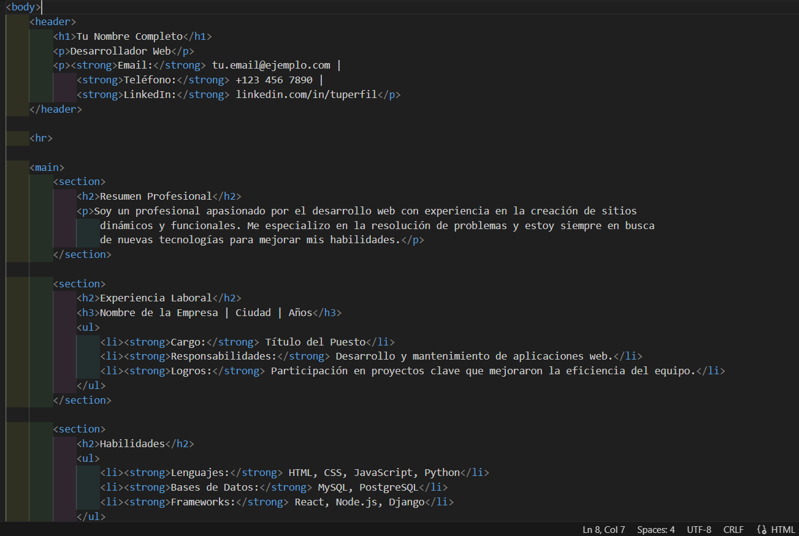
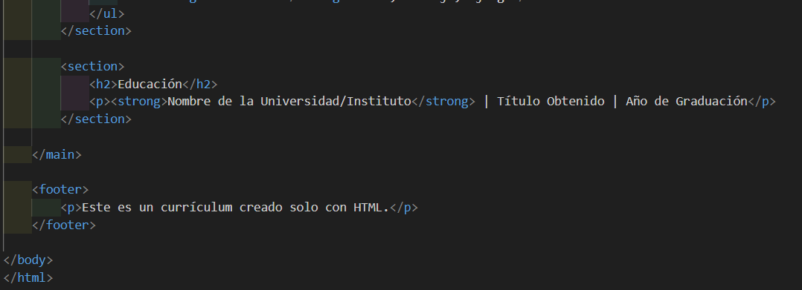
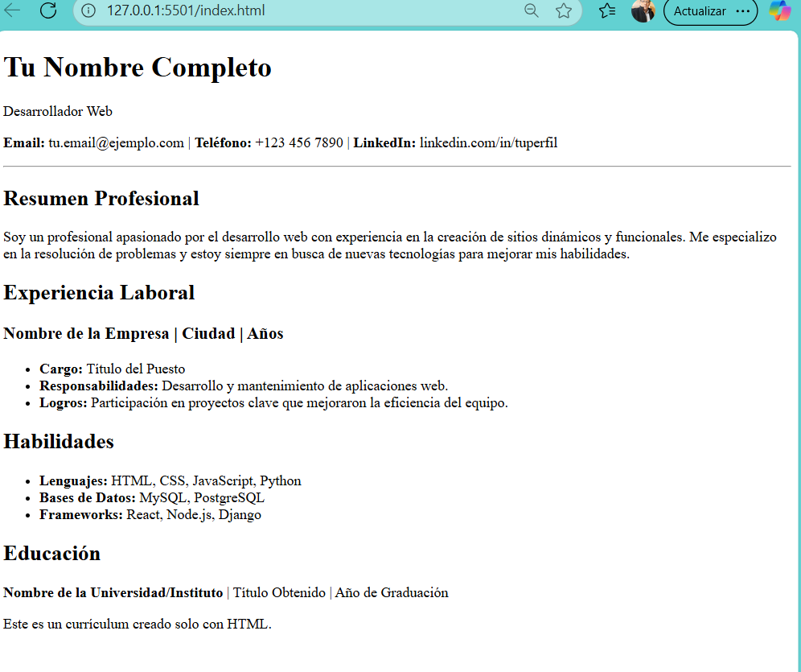
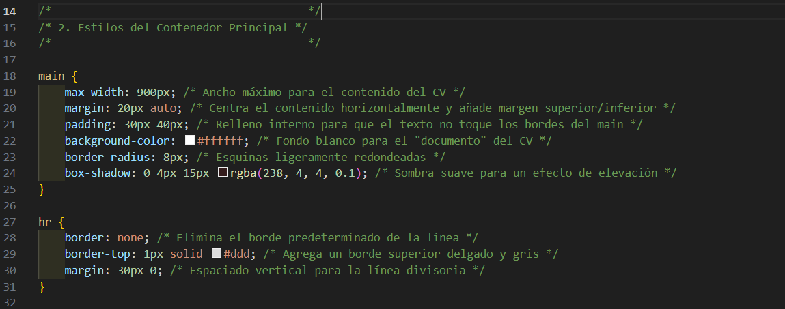
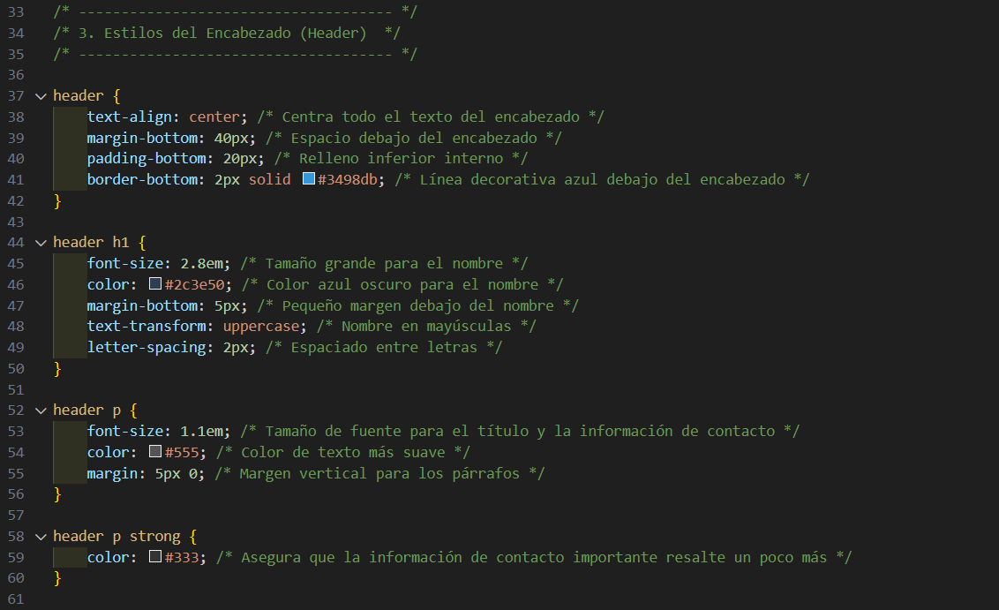
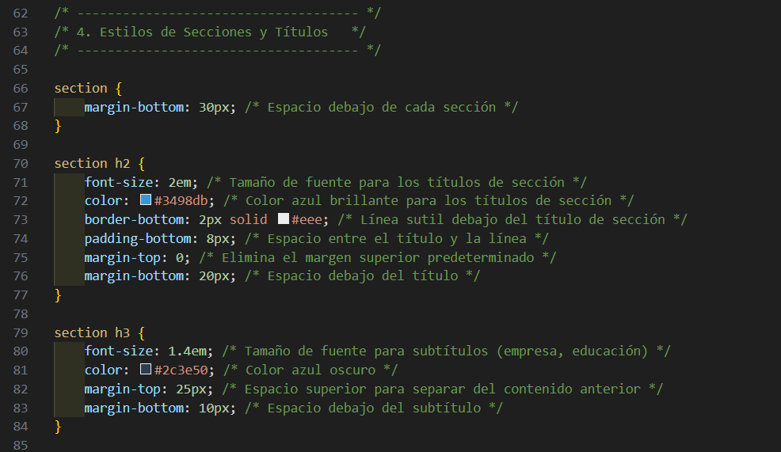
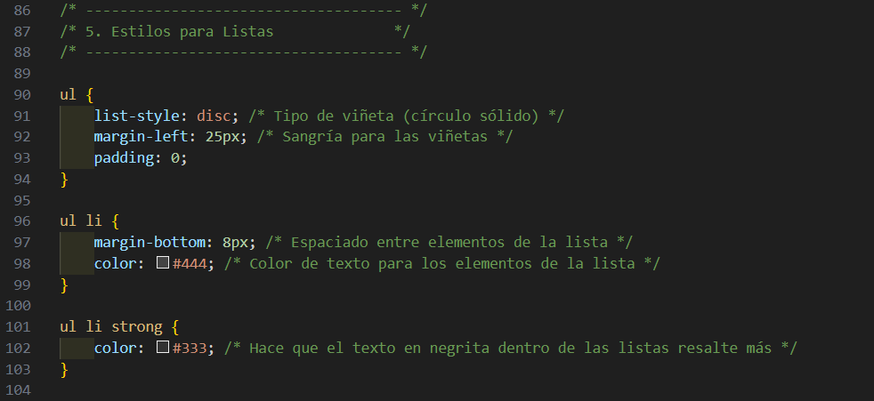
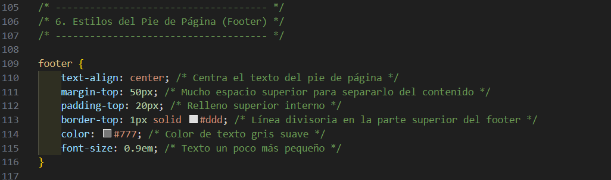
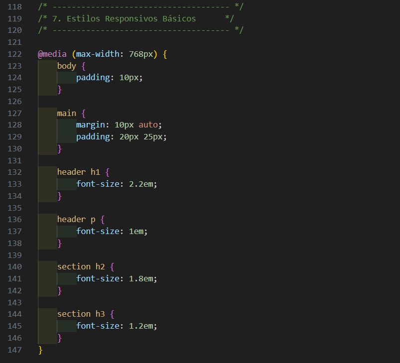

# Ejercicio 1 - Estructura de un documento HTML
## Creación del Curriculum vitae con HTML
### Paso 1: Configuración del Proyecto
Crea una carpeta llamada "mi-cv". Dentro de ella, solo necesitarás un archivo: index.html.

mi-cv/
   └── index.html

### Paso 2: Estructura Básica del HTML
Abre index.html y comienza con la estructura fundamental de cualquier documento HTML. Esto incluye el tipo de documento, el idioma, y las secciones head y body.

### HTML

```html
<!DOCTYPE html>
<html lang="es">
<head>
    <meta charset="UTF-8">
    <meta name="viewport" content="width=device-width, initial-scale=1.0">
    <title>Mi Currículum Vitae</title>
</head>
<body>
    
</body>
</html>
```

- `<!DOCTYPE html>`: Declara que es un documento HTML5.
- `<html lang="es">`: La etiqueta principal que define el idioma de la página.
- `<head>`: Contiene metadatos, como el título de la página que aparece en la pestaña del navegador.
- `<body>`: Contiene todo el contenido visible de tu CV.

### Paso 3: Añadiendo el Contenido del CV
Ahora, dentro de la etiqueta `<body>`, vamos a usar etiquetas de HTML para organizar el contenido en secciones lógicas.

### HTML
```html ``



### Explicación de las etiquetas utilizadas:
- `<header>`: Contenedor para el encabezado de la página, ideal para el nombre y la información de contacto.
- `<h1>` y `<h2>`: Encabezados que organizan el contenido en jerarquía. `<h1>` es el más importante (tu nombre) y `<h2>` para las secciones principales.
- `<p>`: Para párrafos de texto.
- `<strong>`: Etiqueta para hacer un texto más importante o en negrita, como las etiquetas de tu información de contacto.
- `<hr>`: Crea una línea horizontal para separar secciones visualmente.
- `<main>`: Contenedor principal para el contenido más importante del documento.
- `<section>`: Define una sección del documento, como "Resumen Profesional" o "Habilidades".
- `<ul>` y `<li>`: Crean una lista no ordenada (viñetas). `<ul>` es el contenedor de la lista y `<li>` es cada elemento de la lista.
- `<footer>`: Contenedor para el pie de página.

### Paso 4: Visualiza tu Currículum
Guarda el archivo index.html y ábrelo en tu navegador.
Verás tu currículum perfectamente estructurado y organizado, aunque sin estilos (sin colores, sin fuentes personalizadas, etc.). Esto demuestra que HTML es la base, la estructura de la página, mientras que CSS es lo que le da la apariencia.




## Proyecto: Currículum Vitae con Estilo Profesional
Es momento de aplicar CSS para transformar el CV HTML básico en un documento visualmente agradable, fácil de leer y profesional, sigue los siguientes pasos para lograrlo.

### Paso 1: Preparación del Proyecto
Asegúrate de tener la siguiente estructura de carpetas. Necesitaremos un archivo HTML (ya lo tenemos) y un archivo CSS.

mi-cv/

   ├── css/
   │   └── styles.css
   └── index.html
Si aún no tienes la carpeta css y el archivo styles.css dentro de ella, créalos ahora.

Paso 2: Revisar el HTML del CV
Verifica de que no haya cambios para que el CSS pueda aplicarse correctamente:
```HTML
<!DOCTYPE html>
<html lang="es">
<head>
    <meta charset="UTF-8">
    <meta name="viewport" content="width=device-width, initial-scale=1.0">
    <title>Mi Currículum Vitae</title>
    <link rel="stylesheet" href="css/styles.css"> 
</head>
```

Asegúrate de haber añadido la línea ``<link rel="stylesheet" href="css/styles.css">`` dentro de la etiqueta ``<head>``. Sin esta línea, tu navegador no sabrá dónde encontrar tus estilos.

Paso 3: Creación del Archivo styles.css y Estilos Iniciales
Abre el archivo css/styles.css (créalo si no existe) y vamos a añadir los estilos paso a paso.

   3.1. Estilos Globales y de body
   Estos estilos afectarán a todo el documento, definiendo la fuente, el color de fondo y el margen general.

   

   Explicación:

``font-family``: Establece una pila de fuentes. El navegador intentará usar Segoe UI primero, luego Tahoma, etc. Si ninguna de esas está disponible, usará una fuente genérica sans-serif.

``line-height``: Aumenta el espacio entre las líneas de texto, haciendo que los párrafos sean más fáciles de leer.

``margin: 0; padding: 20px;``: Resetea el margen predeterminado del body y agrega un relleno general para que el contenido no esté pegado a los bordes de la ventana.

``background-color y color``: Definen el color de fondo de toda la página y el color de texto por defecto.

3.2. Estilos para el Contenedor Principal (``main``) y ``hr``
Vamos a centrar el CV en la pantalla y darle un aspecto de "documento" con un fondo blanco y una sombra.   
   

Explicación:

``main``:

``max-width``: Impide que el CV se estire demasiado en pantallas grandes, manteniendo la legibilidad.

``margin: 20px auto;``: auto en los márgenes izquierdo y derecho, combinado con un max-width, es la forma estándar de centrar un bloque de contenido.

``padding``: Espacio interno entre el borde del main y su contenido.

``background-color, border-radius, box-shadow``: Estos juntos crean el efecto de una hoja de papel elevada sobre el fondo de la página.

``hr``: Le damos un estilo más discreto y moderno a la línea divisoria.

3.3. Estilos para el Encabezado (``header``)
El encabezado es la primera impresión. Le daremos un estilo claro y centrado.

   

Explicación:

``text-align``: center;: Centra los elementos de texto dentro del header.

``h1``: Se estiliza para que el nombre del candidato sea prominente y profesional.

``p``: Los párrafos de contacto tienen un tamaño y color más moderados.

``border-bottom``: Una línea azul debajo del encabezado ayuda a separarlo visualmente del resto del CV.

3.4. Estilos para Secciones (``section``) y Títulos (``h2, h3``)
Cada sección del CV necesita un título claro y un espaciado adecuado.

   

   

   

   

   

   

