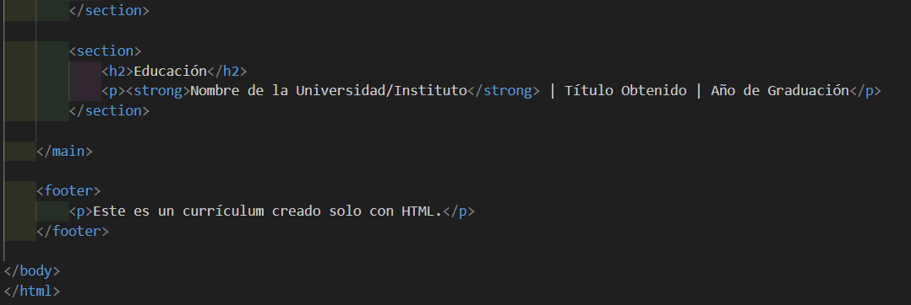

# Ejercicio 1 - Estructura de un documento HTML

## Paso 1: Configuración del Proyecto
Crea una carpeta llamada "mi-cv". Dentro de ella, solo necesitarás un archivo: index.html.

mi-cv/
└── index.html

## Paso 2: Estructura Básica del HTML
Abre index.html y comienza con la estructura fundamental de cualquier documento HTML. Esto incluye el tipo de documento, el idioma, y las secciones head y body.

### HTML


```html
<!DOCTYPE html>
<html lang="es">
<head>
    <meta charset="UTF-8">
    <meta name="viewport" content="width=device-width, initial-scale=1.0">
    <title>Mi Currículum Vitae</title>
</head>
<body>
    
</body>
</html>
```

- `<!DOCTYPE html>`: Declara que es un documento HTML5.
- `<html lang="es">`: La etiqueta principal que define el idioma de la página.
- `<head>`: Contiene metadatos, como el título de la página que aparece en la pestaña del navegador.
- `<body>`: Contiene todo el contenido visible de tu CV.

## Paso 3: Añadiendo el Contenido del CV
Ahora, dentro de la etiqueta `<body>`, vamos a usar etiquetas de HTML para organizar el contenido en secciones lógicas.

### HTML

```html
<body>

    <header>
        <h1>Tu Nombre Completo</h1>
        <p>Desarrollador Web</p>
        <p><strong>Email:</strong> tu.email@ejemplo.com | <strong>Teléfono:</strong> +123 456 7890 | <strong>LinkedIn:</strong> linkedin.com/in/tuperfil</p>
    </header>

    <hr>

    <main>
        <section>
            <h2>Resumen Profesional</h2>
            <p>Soy un profesional apasionado por el desarrollo web con experiencia en la creación de sitios dinámicos y funcionales. Me especializo en la resolución de problemas y estoy siempre en busca de nuevas tecnologías para mejorar mis habilidades.</p>
        </section>

        <section>
            <h2>Experiencia Laboral</h2>
            <h3>Nombre de la Empresa | Ciudad | Años</h3>
            <ul>
                <li><strong>Cargo:</strong> Título del Puesto</li>
                <li><strong>Responsabilidades:</strong> Desarrollo y mantenimiento de aplicaciones web.</li>
                <li><strong>Logros:</strong> Participación en proyectos clave que mejoraron la eficiencia del equipo.</li>
            </ul>
        </section>

        <section>
            <h2>Habilidades</h2>
            <ul>
                <li><strong>Lenguajes:</strong> HTML, CSS, JavaScript, Python</li>
                <li><strong>Bases de Datos:</strong> MySQL, PostgreSQL</li>
                <li><strong>Frameworks:</strong> React, Node.js, Django</li>
            </ul>
        </section>

        <section>
            <h2>Educación</h2>
            <p><strong>Nombre de la Universidad/Instituto</strong> | Título Obtenido | Año de Graduación</p>
        </section>

    </main>

    <footer>
        <p>Este es un currículum creado solo con HTML.</p>
    </footer>

</body>
```

### Explicación de las etiquetas utilizadas:
- `<header>`: Contenedor para el encabezado de la página, ideal para el nombre y la información de contacto.
- `<h1>` y `<h2>`: Encabezados que organizan el contenido en jerarquía. `<h1>` es el más importante (tu nombre) y `<h2>` para las secciones principales.
- `<p>`: Para párrafos de texto.
- `<strong>`: Etiqueta para hacer un texto más importante o en negrita, como las etiquetas de tu información de contacto.
- `<hr>`: Crea una línea horizontal para separar secciones visualmente.
- `<main>`: Contenedor principal para el contenido más importante del documento.
- `<section>`: Define una sección del documento, como "Resumen Profesional" o "Habilidades".
- `<ul>` y `<li>`: Crean una lista no ordenada (viñetas). `<ul>` es el contenedor de la lista y `<li>` es cada elemento de la lista.
- `<footer>`: Contenedor para el pie de página.

## Paso 4: Visualiza tu Currículum
Guarda el archivo index.html y ábrelo en tu navegador.
Verás tu currículum perfectamente estructurado y organizado, aunque sin estilos (sin colores, sin fuentes personalizadas, etc.). Esto demuestra que HTML es la base, la estructura de la página, mientras que CSS es lo que le da la apariencia.
