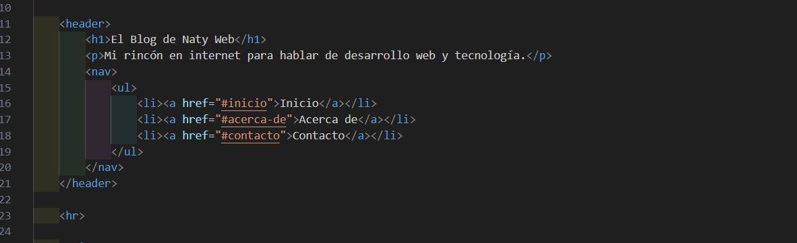
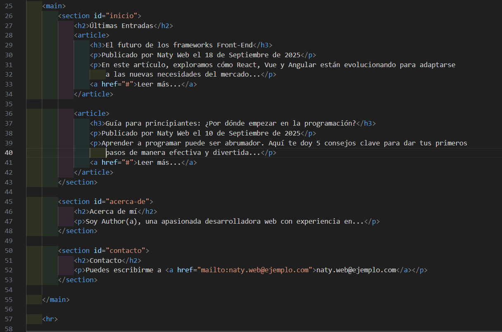
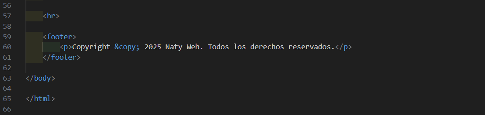

#Ejercicio 2 - Blog Personal aplicando estructura semántica
Vamos a crear un proyecto funcional que aplique la estructura de un documento HTML para un Blog Personal Sencillo. Este proyecto te ayudará a entender cómo las etiquetas semánticas (``<header>, <main>, <article>``, etc.) organizan el contenido de una página web.


## Paso 1: Configuración del Proyecto
Crea una carpeta llamada "mi-cv". Dentro de ella, solo necesitarás un archivo: index.html.

mi-cv/

     └── index.html

## Paso 2: Estructura Básica del HTML
Abre index.html y comienza con la estructura fundamental de cualquier documento HTML. Esto incluye el tipo de documento, el idioma, y las secciones head y body.

### HTML

```html
<!DOCTYPE html>
<html lang="es">
<head>
    <meta charset="UTF-8">
    <meta name="viewport" content="width=device-width, initial-scale=1.0">
    <title>Mi Blog Personal</title>
</head>
<body>
    </body>
</html>
```
``<!DOCTYPE html>``: Declara que el documento es HTML5.

``<html lang="es">``: La etiqueta raíz que envuelve todo el contenido. El atributo lang es crucial para la accesibilidad y el SEO.

``<head>``: Contiene los metadatos de la página. El meta charset asegura que los caracteres especiales se muestren correctamente, y el viewport es esencial para que la página sea responsiva en móviles y tabletas.

``<title>``: Define el texto que aparecerá en la pestaña del navegador.

## Paso 3: Añadiendo Contenido Semántico al <body>
Ahora, dentro del <body>, usaremos etiquetas semánticas para organizar el contenido de un blog. Estas etiquetas no solo estructuran la información para los navegadores, sino que también mejoran la accesibilidad y el SEO.

### HTML




Explicación de las etiquetas semánticas:

``<header>``: Contiene la introducción de la página, como el título principal y la navegación.

``<nav>``: Agrupa los enlaces de navegación.

``<main>``: Representa el contenido principal y único de la página. Todo lo que está dentro de <main> no se repite en otras páginas.

``<section>``: Define una sección temática en el documento, como "Últimas Entradas" o "Contacto".

``<article>``: Contiene una pieza de contenido independiente y auto-suficiente, como una entrada de blog completa.

``<footer>``: Contiene información de pie de página, como derechos de autor, enlaces de contacto o información del autor.

## Paso 4: ¡Visualiza tu Blog!
Guarda el archivo y ábrelo con tu navegador. Verás tu blog estructurado y listo. Aunque no tendrá estilos visuales, la estructura lógica está completa y optimizada para cualquier navegador o motor de búsqueda.


