# Tipos de Entrada HTML
Estos son los diferentes tipos de entrada que puedes utilizar en HTML:

```HTML
<input type="button">
<input type="checkbox">
<input type="color">
<input type="date">
<input type="datetime-local">
<input type="email">
<input type="file">
<input type="hidden">
<input type="image">
<input type="month">
<input type="number">
<input type="password">
<input type="radio">
<input type="range">
<input type="reset">
<input type="search">
<input type="submit">
<input type="tel">
<input type="text">
<input type="time">
<input type="url">
<input type="week">
```
**Consejo: El valor predeterminado del type atributo es "texto".**

## Tipo de entrada Texto
- `<input type="text">` define un campo de entrada de texto de una sola línea :

Ejemplo
```HTML
<form>
  <label for="fname">First name:</label><br>
  <input type="text" id="fname" name="fname"><br>
  <label for="lname">Last name:</label><br>
  <input type="text" id="lname" name="lname">
</form>
```
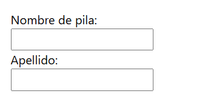

## Tipo de entrada Contraseña
- `<input type="password">` define un campo de contraseña :

**Ejemplo**
```HTML
<form>
  <label for="username">Username:</label><br>
  <input type="text" id="username" name="username"><br>
  <label for="pwd">Password:</label><br>
  <input type="password" id="pwd" name="pwd">
</form>
```
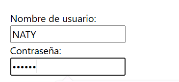

**Los caracteres en un campo de contraseña están enmascarados (se muestran como asteriscos o círculos).**

## Tipo de entrada Enviar
- `<input type="submit">` define un botón para enviar datos del formulario a un controlador de formulario .

- El controlador de formulario normalmente es una página de servidor con un script para procesar datos de entrada.

- El controlador del formulario se especifica en el action atributo del formulario:

**Ejemplo**
```HTML
<form action="/action_page.php">
  <label for="fname">First name:</label><br>
  <input type="text" id="fname" name="fname" value="John"><br>
  <label for="lname">Last name:</label><br>
  <input type="text" id="lname" name="lname" value="Doe"><br><br>
  <input type="submit" value="Submit">
</form>
```
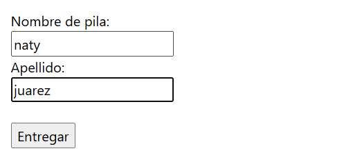

Si omite el atributo de valor del botón Enviar, el botón obtendrá un texto predeterminado:

**Ejemplo**
```HTML
<form action="/action_page.php">
  <label for="fname">First name:</label><br>
  <input type="text" id="fname" name="fname" value="John"><br>
  <label for="lname">Last name:</label><br>
  <input type="text" id="lname" name="lname" value="Doe"><br><br>
  <input type="submit">
</form>
```

## Tipo de entrada Restablecer
- `<input type="reset">`define un botón de reinicio que restablecerá todos los valores del formulario a sus valores predeterminados:

**Ejemplo**
```HTML
<form action="/action_page.php">
  <label for="fname">First name:</label><br>
  <input type="text" id="fname" name="fname" value="John"><br>
  <label for="lname">Last name:</label><br>
  <input type="text" id="lname" name="lname" value="Doe"><br><br>
  <input type="submit" value="Submit">
  <input type="reset" value="Reset">
</form>
```

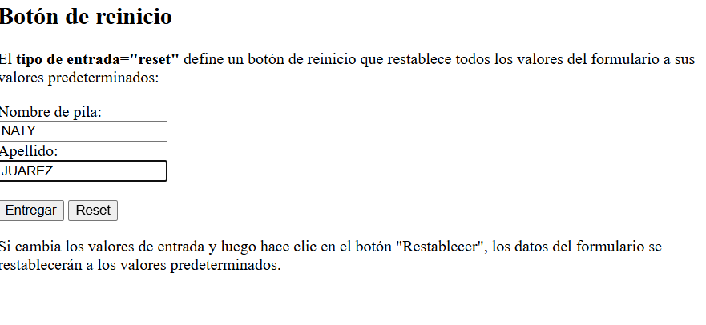

## Tipo de entrada Radio
- `<input type="radio">` define un botón de opción .

- Los botones de opción permiten al usuario seleccionar SÓLO UNA de un número limitado de opciones:

**Ejemplo**
```HTML
<p>Choose your favorite Web language:</p>

<form>
  <input type="radio" id="html" name="fav_language" value="HTML">
  <label for="html">HTML</label><br>
  <input type="radio" id="css" name="fav_language" value="CSS">
  <label for="css">CSS</label><br>
  <input type="radio" id="javascript" name="fav_language" value="JavaScript">
  <label for="javascript">JavaScript</label>
</form>
```

Así es como se mostrará el código HTML anterior en un navegador:

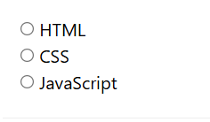

## Tipo de entrada Casilla de verificación
- `<input type="checkbox">`define una casilla de verificación .

- Las casillas de verificación permiten al usuario seleccionar CERO o MÁS opciones de un número limitado de opciones.

**Ejemplo**
```HTML
<form>
  <input type="checkbox" id="vehicle1" name="vehicle1" value="Bike">
  <label for="vehicle1"> I have a bike</label><br>
  <input type="checkbox" id="vehicle2" name="vehicle2" value="Car">
  <label for="vehicle2"> I have a car</label><br>
  <input type="checkbox" id="vehicle3" name="vehicle3" value="Boat">
  <label for="vehicle3"> I have a boat</label>
</form>
```

Así es como se mostrará el código HTML anterior en un navegador:

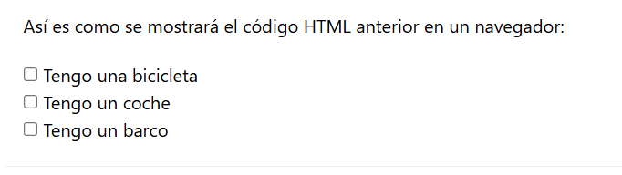

## Tipo de entrada Botón de
- `<input type="button">` define un botón :

**Ejemplo**
`<input type="button" onclick="alert('Hello World!')" value="Click Me!">`

Así es como se mostrará el código HTML anterior en un navegador:

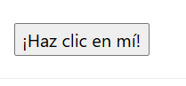


## Tipo de entrada Color
- Se `<input type="color">`utiliza para campos de entrada que deben contener un color.

- Dependiendo de la compatibilidad del navegador, puede aparecer un selector de color en el campo de entrada.

**Ejemplo**
```HTML
<form>
  <label for="favcolor">Select your favorite color:</label>
  <input type="color" id="favcolor" name="favcolor">
</form>
```
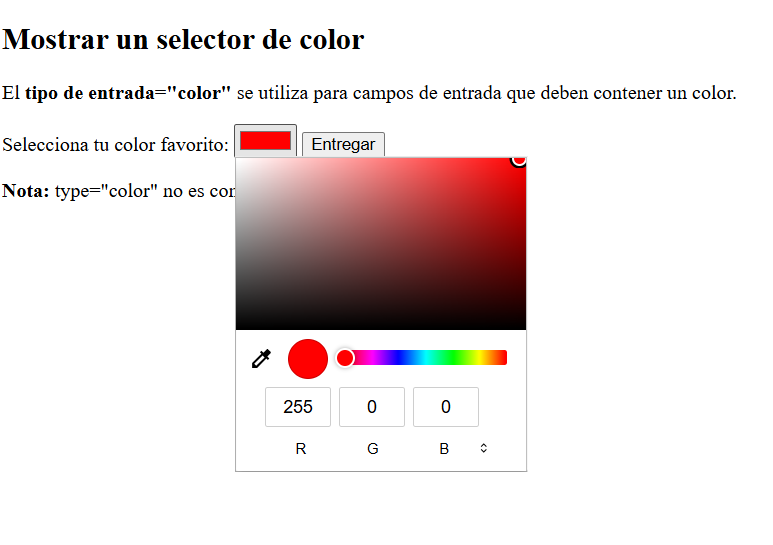


## Tipo de entrada Fecha (AGREGAR IMAGEN A PARTIR DE AQUI)
- Se `<input type="date">`utiliza para campos de entrada que deben contener una fecha.

- Dependiendo de la compatibilidad del navegador, puede aparecer un selector de fecha en el campo de entrada.

**Ejemplo**
```HTML
<form>
  <label for="birthday">Birthday:</label>
  <input type="date" id="birthday" name="birthday">
</form>
```
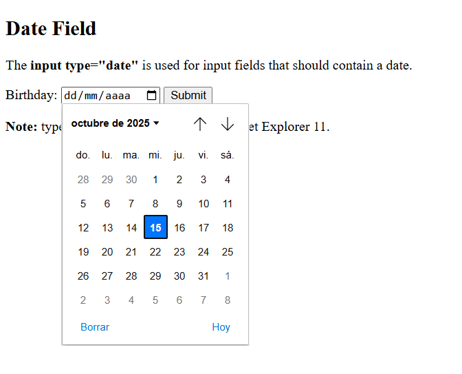
También puedes utilizar los atributos miny maxpara agregar restricciones a las fechas:

**Ejemplo**
```HTML
<form>
  <label for="datemax">Enter a date before 1980-01-01:</label>
  <input type="date" id="datemax" name="datemax" max="1979-12-31"><br><br>
  <label for="datemin">Enter a date after 2000-01-01:</label>
  <input type="date" id="datemin" name="datemin" min="2000-01-02">
</form>
```
## Tipo de entrada Fecha y hora local
- Especifica `<input type="datetime-local">`un campo de entrada de fecha y hora, sin zona horaria.

- Dependiendo de la compatibilidad del navegador, puede aparecer un selector de fecha en el campo de entrada.

**Ejemplo**
```HTML
<form>
  <label for="birthdaytime">Birthday (date and time):</label>
  <input type="datetime-local" id="birthdaytime" name="birthdaytime">
</form>
```
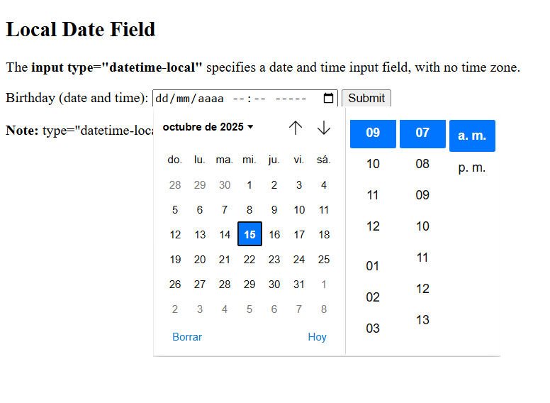
## Tipo de entrada Correo electrónico
- Se `<input type="email">` utiliza para campos de entrada que deben contener una dirección de correo electrónico.

- Dependiendo de la compatibilidad del navegador, la dirección de correo electrónico puede validarse automáticamente al enviarla.

- Algunos teléfonos inteligentes reconocen el tipo de correo electrónico y agregan ".com" al teclado para que coincida con la entrada de correo electrónico.

**Ejemplo**
```HTML
<form>
  <label for="email">Enter your email:</label>
  <input type="email" id="email" name="email">
</form>
```

## Tipo de entrada Imagen
- Define `<input type="image">` una imagen como un botón de envío.

- La ruta a la imagen se especifica en el srcatributo.

**Ejemplo**
```HTML
<form>
<input type="image" src="img_submit.gif" alt="Submit" width="48" height="48">
</form>
```
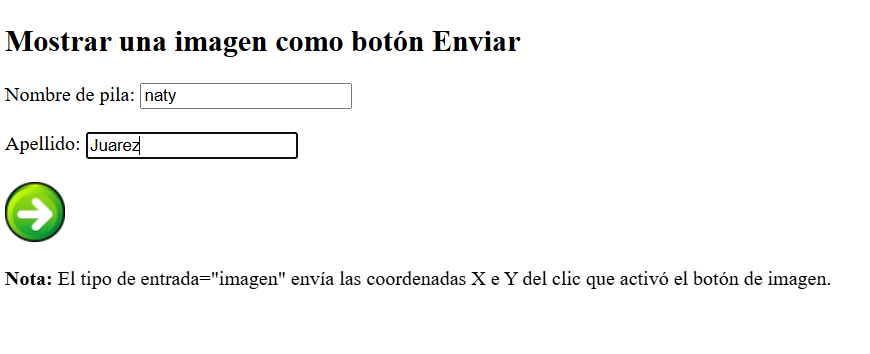
## Archivo de tipo de entrada
Define `<input type="file">` un campo de selección de archivos y un botón "Explorar" para cargar archivos.

**Ejemplo**
```HTML
<form>
  <label for="myfile">Select a file:</label>
  <input type="file" id="myfile" name="myfile">
</form>
```

## Tipo de entrada oculto
Define `<input type="hidden">` un campo de entrada oculto (no visible para el usuario).

- Un campo oculto permite a los desarrolladores web incluir datos que los usuarios no pueden ver ni modificar cuando se envía un formulario.

- Un campo oculto a menudo almacena qué registro de base de datos debe actualizarse cuando se envía el formulario.

**Nota:** Aunque el valor no se muestra al usuario en el contenido de la página, es visible (y se puede editar) mediante las herramientas de desarrollo de cualquier navegador o la función "Ver código fuente". No utilice entradas ocultas como medida de seguridad.

**Ejemplo**
```HTML
<form>
  <label for="fname">First name:</label>
  <input type="text" id="fname" name="fname"><br><br>
  <input type="hidden" id="custId" name="custId" value="3487">
  <input type="submit" value="Submit">
</form>
```

## Tipo de entrada Mes
Permite `<input type="month">`al usuario seleccionar un mes y un año.

Dependiendo de la compatibilidad del navegador, puede aparecer un selector de fecha en el campo de entrada.

**Ejemplo**
```HTML
<form>
  <label for="bdaymonth">Birthday (month and year):</label>
  <input type="month" id="bdaymonth" name="bdaymonth">
</form>
```
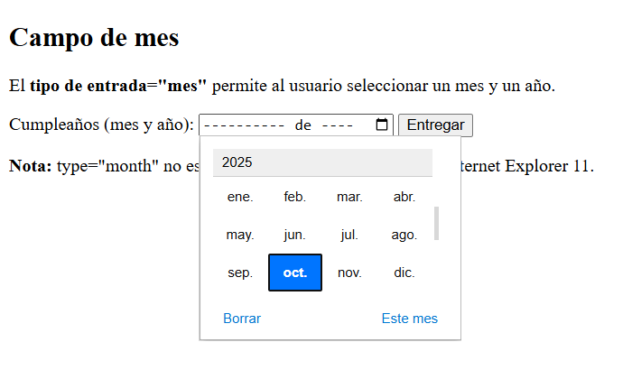
## Número de tipo de entrada
El `<input type="number">` define un campo de entrada numérica .

- También puedes establecer restricciones sobre qué números se aceptan.

- El siguiente ejemplo muestra un campo de entrada numérico, donde puede ingresar un valor del 1 al 5:

**Ejemplo**
```HTML
<form>
  <label for="quantity">Quantity (between 1 and 5):</label>
  <input type="number" id="quantity" name="quantity" min="1" max="5">
</form>
```
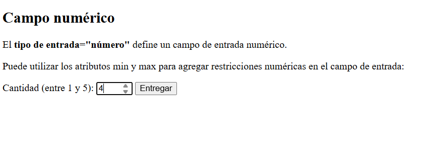

