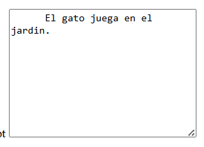

# Tipos de Entrada HTML
Estos son los diferentes tipos de entrada que puedes utilizar en HTML:

```HTML
<input type="button">
<input type="checkbox">
<input type="color">
<input type="date">
<input type="datetime-local">
<input type="email">
<input type="file">
<input type="hidden">
<input type="image">
<input type="month">
<input type="number">
<input type="password">
<input type="radio">
<input type="range">
<input type="reset">
<input type="search">
<input type="submit">
<input type="tel">
<input type="text">
<input type="time">
<input type="url">
<input type="week">
```
**Consejo: El valor predeterminado del typeatributo es "texto".**

## Tipo de entrada Texto
`<input type="text">` define un campo de entrada de texto de una sola línea :

Ejemplo
```HTML
<form>
  <label for="fname">First name:</label><br>
  <input type="text" id="fname" name="fname"><br>
  <label for="lname">Last name:</label><br>
  <input type="text" id="lname" name="lname">
</form>
```


## Tipo de entrada Contraseña
`<input type="password">` define un campo de contraseña :

**Ejemplo**
```HTML
<form>
  <label for="username">Username:</label><br>
  <input type="text" id="username" name="username"><br>
  <label for="pwd">Password:</label><br>
  <input type="password" id="pwd" name="pwd">
</form>
```


**Los caracteres en un campo de contraseña están enmascarados (se muestran como asteriscos o círculos).**

## Tipo de entrada Enviar
`<input type="submit">` define un botón para enviar datos del formulario a un controlador de formulario .

El controlador de formulario normalmente es una página de servidor con un script para procesar datos de entrada.

El controlador del formulario se especifica en el action atributo del formulario:

**Ejemplo**
```HTML
<form action="/action_page.php">
  <label for="fname">First name:</label><br>
  <input type="text" id="fname" name="fname" value="John"><br>
  <label for="lname">Last name:</label><br>
  <input type="text" id="lname" name="lname" value="Doe"><br><br>
  <input type="submit" value="Submit">
</form>
```


Si omite el atributo de valor del botón Enviar, el botón obtendrá un texto predeterminado:

**Ejemplo**
```HTML
<form action="/action_page.php">
  <label for="fname">First name:</label><br>
  <input type="text" id="fname" name="fname" value="John"><br>
  <label for="lname">Last name:</label><br>
  <input type="text" id="lname" name="lname" value="Doe"><br><br>
  <input type="submit">
</form>
```

## Tipo de entrada Restablecer
`<input type="reset">`define un botón de reinicio que restablecerá todos los valores del formulario a sus valores predeterminados:

**Ejemplo**
```HTML
<form action="/action_page.php">
  <label for="fname">First name:</label><br>
  <input type="text" id="fname" name="fname" value="John"><br>
  <label for="lname">Last name:</label><br>
  <input type="text" id="lname" name="lname" value="Doe"><br><br>
  <input type="submit" value="Submit">
  <input type="reset" value="Reset">
</form>
```


