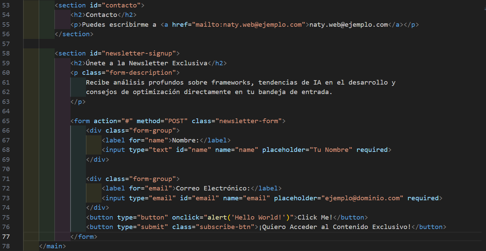
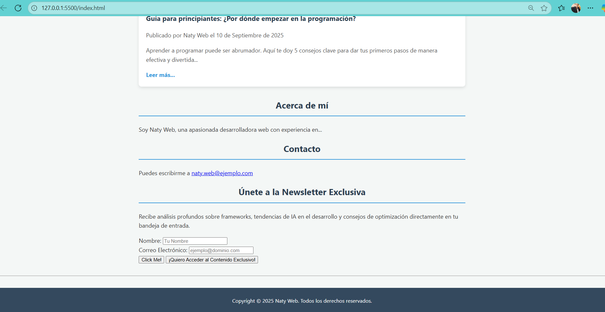
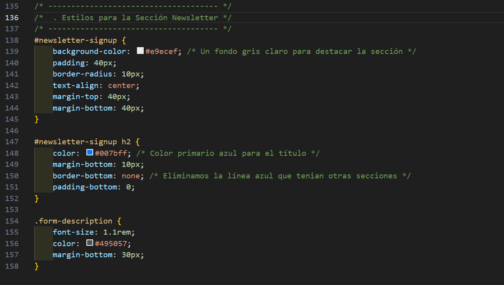
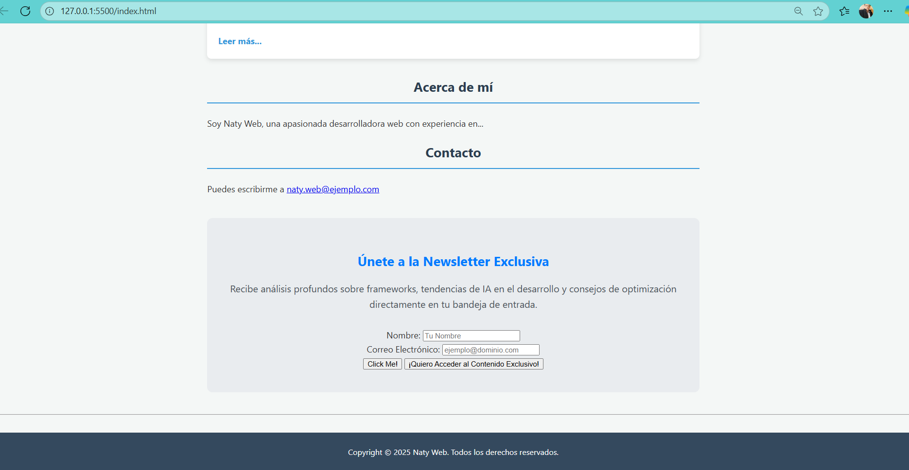

# Agregar un Formulario al Blog Perosnal

## Paso 1: Estructura HTML del Formulario
Vamos a añadir el formulario a tu archivo index.html, justo después de la sección de "Contacto", para que quede bien ubicado en la parte final del contenido.

### Inclusión del Formulario en index.html
- Localiza la etiqueta de cierre de tu sección de contacto (`</section>`) dentro del `<main>` y agrega el siguiente código justo después:

### Explicación de la Estructura HTML del Formulario
- `<section id="newsletter-signup">`: Creamos una nueva sección para el formulario. Esto es fundamental para la semántica del documento.

- `<h2>` y `
`: Título y descripción atractivos para motivar la suscripción.

- `<form action="#" method="POST" class="newsletter-form"`>: La etiqueta contenedora del formulario.

- `action="#"`: Indica dónde se enviarán los datos. Usamos # como marcador de posición, ya que para que funcione necesitarías un backend (JavaScript o un servidor).

- `method="POST"`: Indica cómo se envían los datos (ocultos en el cuerpo de la petición).

- `class="newsletter-form"`: Una clase específica para aplicar estilos.

- `
`: Contenedores para agrupar las etiquetas (<label>) y los campos (<input>). Esto nos facilitará aplicar estilos de espaciado.

- `<label for="name">`: La etiqueta que describe el campo. El atributo for debe coincidir con el id del campo de entrada. Esto es crucial para la accesibilidad.

- `<input type="text" id="name" name="name" ... required>`: El campo de entrada de texto.

- `type="text" o type="email"`: Define el tipo de dato que se espera. email activa el teclado de email en móviles.

- id y name: El id se usa con el label y el name es lo que usará el backend para identificar el dato.

- placeholder: Texto que aparece en el campo antes de que el usuario escriba.

- required: Un atributo HTML5 que impide el envío del formulario si el campo está vacío.

- `<button type="submit" class="subscribe-btn">`: El botón que activa el envío del formulario.

**El formulario se vería de la siguiente manera:**

## Paso 2: Aplicación de Estilos CSS al Formulario
Ahora vamos a darle un estilo profesional al formulario dentro de tu archivo css/styles.css.

### Estilos para la Nueva Sección y Contenedor del Formulario
Añade los siguientes estilos a tu styles.css. Puedes colocarlos al final del bloque de estilos de las secciones.

**Explicación:**

- #newsletter-signup: Le damos un fondo gris claro (#e9ecef) y relleno (padding: 40px) para que la sección de suscripción resalte del fondo general de la página.

- h2: Cambiamos el color a azul primario (#007bff) y eliminamos el borde inferior que usamos en otros títulos de sección para darle un aspecto más limpio.

- .form-description: Un estilo simple para que el texto sea legible y persuasivo.

### Estilos para los Campos y el Botón
Ahora aplicamos estilos específicos a los grupos de entrada, los campos y el botón.

CSS

/* Estilos del Formulario */
.newsletter-form {
    max-width: 500px; /* Ancho máximo para el formulario */
    margin: 0 auto; /* Centra el formulario */
    display: flex; /* Usamos Flexbox para organizar el contenido */
    flex-direction: column; /* Apilamos los elementos verticalmente */
    gap: 15px; /* Espacio entre los grupos de campos */
}

.form-group {
    text-align: left; /* Alinea las etiquetas a la izquierda */
}

.form-group label {
    display: block; /* La etiqueta ocupa todo el ancho */
    margin-bottom: 5px;
    font-weight: 600; /* Semi-negrita para las etiquetas */
    color: #212529;
}

.form-group input {
    width: 100%; /* El campo de entrada ocupa todo el ancho del contenedor */
    padding: 12px;
    border: 1px solid #ced4da; /* Borde gris suave */
    border-radius: 5px;
    box-sizing: border-box; /* Asegura que padding y border estén incluidos en el width */
    font-size: 1rem;
    transition: border-color 0.3s ease, box-shadow 0.3s ease;
}

.form-group input:focus {
    border-color: #007bff; /* Borde azul al enfocar */
    box-shadow: 0 0 0 0.2rem rgba(0, 123, 255, 0.25); /* Sombra suave azul al enfocar */
    outline: none; /* Elimina el contorno predeterminado del navegador */
}

/* Estilos del Botón de Suscripción */
.subscribe-btn {
    background-color: #28a745; /* Fondo verde para el botón de acción (éxito) */
    color: white;
    border: none;
    padding: 15px 25px;
    border-radius: 5px;
    cursor: pointer;
    font-size: 1.1rem;
    font-weight: bold;
    transition: background-color 0.3s ease, transform 0.2s ease;
}

.subscribe-btn:hover {
    background-color: #218838; /* Verde más oscuro al pasar el mouse */
    transform: translateY(-2px); /* Efecto sutil de elevación */
}
Explicación Detallada de los Estilos del Formulario:

.newsletter-form:

max-width: 500px; margin: 0 auto;: Limita el ancho del formulario y lo centra horizontalmente.

display: flex; flex-direction: column; gap: 15px;: Utiliza Flexbox para apilar las cajas de entrada verticalmente y añadir un espacio constante (gap) entre ellas.

.form-group:

text-align: left;: Asegura que el texto (las etiquetas) se alinee a la izquierda, ya que la sección padre está centrada.

.form-group label:

display: block;: Hace que la etiqueta ocupe todo el ancho disponible, forzando al campo de entrada a la siguiente línea (aunque ya están agrupados en un div).

font-weight: 600;: Pone el texto de la etiqueta en semi-negrita para que sea claro.

.form-group input:

width: 100%;: Hace que el campo de entrada se expanda para llenar todo el ancho disponible.

padding: 12px; border: 1px solid #ced4da;: Le da al campo un relleno interno cómodo y un borde gris suave y moderno.

box-sizing: border-box;: Propiedad crítica. Asegura que el padding y el border se incluyan dentro del width del 100%, evitando que el campo se desborde del contenedor.

.form-group input:focus: El pseudo-selector :focus aplica estilos cuando el usuario hace clic en el campo.

border-color: #007bff; box-shadow: ...;: Añade un borde azul brillante y una sombra suave azul al campo activo. Esto proporciona una excelente retroalimentación visual al usuario.

outline: none;: Elimina el horrible borde de enfoque que algunos navegadores añaden por defecto.

.subscribe-btn:

background-color: #28a745;: Usamos un verde (color de éxito/aceptación) para el botón de acción.

padding, font-weight, font-size: Hacen que el botón sea grande, legible y fácil de pulsar.

transition: Prepara los efectos de hover.

.subscribe-btn:hover:

background-color: #218838; transform: translateY(-2px);: Al pasar el mouse, el botón se oscurece y se mueve 2px hacia arriba, simulando un clic y dándole un efecto dinámico y profesional.

Paso 3: Visualizar el Formulario con Estilo
Guarda ambos archivos: Asegúrate de guardar los cambios en index.html y en css/styles.css.

Abre index.html en tu navegador.
