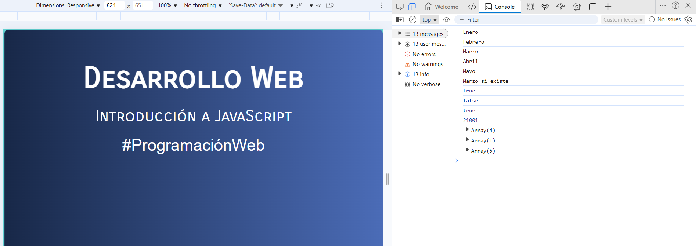

# Java Script

## ¿Qué es JavaScript?
JavaScript es un lenguaje de programación que permite crear contenido web interactivo y dinámico, trabajando junto con HTML y CSS para que las páginas web sean más que simple texto y gráficos estáticos. 

Es el lenguaje de la web.
- Añade interactividad a tus sitios web
- Desarrollo Front End.
- Desarrollo Back End.
- Desarrollo de aplicaciones Móviles y escritorio.

## JavaScript es un lenguaje maduro y estable
JavaScript tiene variables, funciones, estructuras de control, métodos lo cual lo hace un lenguaje de programación a diferencia de HTML o CSS

Esta lección te dará una introducción a JavaScript, realizarás una serie de ejercicios que te permitirán conoccer lo básico del lenguaje. Descarga previamente la carpeta IntroducciónJS, esta contiene: un archivo index.html y un archivo style.css los cuales te permitirán ejecutar cada uno de los ejercicios que iras realizando.

## Variables en JavaScript

### Tipos de declaraciones de variables
- let: Declara una variable local con alcance de bloque. Se puede reasignar a un nuevo valor.
  Ejemplo: let nombre = "Juan";
- const: Declara una constante, que no se puede reasignar después de su inicialización.
  Ejemplo: const pi = 3.14;
- var: Declara una variable con alcance de función o global. Se puede reasignar y redeclarar, aunque esto puede generar errores y no es la práctica recomendada en el código moderno.

### Ejercicio 01.js:
Procedimiento:
- Crea una carpeta llamada **js**
- Crea un archivo llamado 01.js
- Enlaza tu archivo .js externo al html
-- Usa la etiqueta ```<script>``` con el atributo src
-- Escribe en el index.html lo siguiente:
  
  ```html
  <script src="js/01.js"></script>
  ```
  Realiza el siguiente ejercicio, los resultados podrás visualizarlo en la consola de ejecución de la página web. Para visualizarlo realiza lo siguiente:
  - 1. Ejecuta tu pagina web en el navegador (por ejemplo: Microsoft Edge)
    2. Da clic derecho sobre la página y elige la opción **Inspeccionar**
         
    4. En la ventana de inspección abierta, da clic en **Console**
         
       
  Nota: Visualizarás los resultados de la ejecución de programas en JavaScript en la Consola. (Esto para el momento para fines didácticos) 


```javascript 
//Variables en Java Script

var producto='Audifonos gamer';     //Iniciar variable y asignar valor
console.log(producto)              //Con esta instrucción visulizamos el valor de la variable producto en consola

var disponible;                     // Iniciamos variable pero sin valor
console.log(disponible)            //Visualizamo en consola

producto=true;                     // reasignamos el valor de la variable
console.log(producto)

disponible=true;
console.log(disponible)

var producto1='computadora',
    disponible1=true,
    categoria='computadoras';
console.log(producto1,disponible1,categoria)

// Estilos de declaración para las variables
var nom_producto='Monitor HD';   //underscore
var nombre='Monitor HD';         //Camelcase
var NombreProducto='Monitor HD'; //pascal case
console.log(NOMBREPRODUCTO);     //Observa que no se mostrara nada, ya que no hay ninguna variable
                                //declarada como NOMBREPRODUCTO todo en mayuscula como
                                //la estamos especificando en el console.

```
## Strings o Cadenas de texto y métodos para los strings
Las cadenas de texto en JavaScript son secuencias de caracteres que se definen con comillas simples ('), dobles (") o comillas invertidas (``). Se usan para representar texto y se pueden manipular mediante métodos y propiedades incorporadas, como length para obtener su longitud, concat() o el operador + para unirlas (concatenación) y replace() para reemplazar partes de ellas.

### Ejercicio 02.js:
Procedimiento:
- Crea un archivo llamado 02.js en la carpeta /js
- Enlaza tu archivo .js externo al html
-- Usa la etiqueta ```<script>``` con el atributo src
-- Escribe en el index.html lo siguiente:
  
  ```html
  <script src="js/02.js"></script>
  ```
Nota: el script anterior 01.js ponlo como comentario, para que solo veas la ejecucion en consola del nuevo script.

```javascript 
//Strings o Cadenas de Textos
const producto='Monitor de 20"';               //puedes utilizar comillas dobles o sencillas, pero si utilizas comilla doble en tu cadena, usa comilla sencilla
const producto2=String("Monitor 30 pulgadas"); //Se crea una cadena utilizando un constructor
const producto3=new String('Monitor 50 pulgadas'); //se crea un objeto de tipo string o cadena.

//Observa los valores que se muestran en consola de cada variable string
console.log(producto);
console.log(producto2);
console.log(producto3);

//Observa los tipos de datos de cada cadena de texto con la funcion **typeof**.
console.log(typeof producto);
console.log(typeof producto2);
console.log(typeof producto3);

//FUNCIONES DE CADENAS DE TEXTO: length, include, indexof
const producto4='Aprendiendo Javascript en programacion Web';
const producto5='Mouse inalambrico';

//length: Obtiene la extención de una cadena
console.log(producto4.length); //muestra en consola la extencion de la cadena

//IndexOf: Obtiene la posicion en la que se encuentra algun texto que estemos buscando
console.log(producto4.indexOf('Javascript'));

//Include: Retorna true o False, si encuentra o no una cadena
console.log(producto4.includes('Javascript'));
console.log(producto4.includes('Tablet'));
```
## Numeros y Operadores
En JavaScript, los números se utilizan para operaciones matemáticas y los operadores son los símbolos que realizan estas operaciones. Los operadores aritméticos comunes son:
  - suma (+),
  - resta (-),
  - multiplicación (*),
  - división (/) y
  - módulo (%).
  - También existen operadores de asignación, como +=, que combinan una operación y una asignación en un solo paso, y
  - operadores como el de exponenciación (**). 

### Ejercicio 03.js
Procedimiento:
- Crea un archivo llamado 03.js en la carpeta /js
- Enlaza tu archivo .js externo al html
-- Usa la etiqueta ```<script>``` con el atributo src
-- Escribe en el index.html lo siguiente:
  
  ```html
  <script src="js/03.js"></script>
  ```
Nota: los script anteriores ponlos como comentario, para que solo veas la ejecucion en consola del nuevo script.

```javascript
//Numeros

const numero1=100;         //declaracion de una constante numerica
const numero2=200;
const nombre="Naty Juarez" //declaracion de una constante de cadena
const numero3=200.20;     //todos las cantidades son del tipo de datos NUMERO
const numero4=.1020;      //No existen el tipo de datos flotante en JS
const numero5=-5; 

console.log(numero1);    //Visualiza en consola la ejecución de tu .js
console.log(numero2);
console.log(nombre);
console.log(numero3);

console.log(typeof numero1);
console.log(typeof numero5); //observa en console que el tipo de datos mostrado es NUMBER

//OPERADORES
const n1=100;
const n2=200;
const n3=9;
const n4=3;
const n5=-5;

console.log(n1 + n2);
console.log(n1 - n2);
console.log(n1 * n2);
console.log(n1 / n2);
console.log(n1 % n4); //operador residuo
```

## El objeto Math en JS
El objeto Math en JavaScript es un objeto incorporado que proporciona funciones y constantes matemáticas estáticas para realizar operaciones. Se usa directamente, sin necesidad de crear una instancia, y sirve para calcular valores como el valor absoluto (Math.abs()), redondear números (Math.floor(), Math.ceil()), obtener la raíz cuadrada (Math.sqrt()) o generar números aleatorios (Math.random()). 

### Ejercicio 04.js
Procedimiento:
- Crea un archivo llamado 04.js en la carpeta /js
- Enlaza tu archivo .js externo al html
-- Usa la etiqueta ```<script>``` con el atributo src
-- Escribe en el index.html lo siguiente:
  
  ```html
  <script src="js/04.js"></script>
  ```
Nota: los script anteriores ponlos como comentario, para que solo veas la ejecucion en consola del nuevo script.

```javascript
/OBJETO MATH en JS
let resultado;         //definimos una variable llama resultado con let

resultado= Math.PI;     //se asigna a la variable resultado el valor de la funcion PI
console.log(resultado);  //Mostramos en consola la variable resultado

resultado=Math.round(2.1); //redondea el numero
console.log(resultado);

resultado=Math.ceil(2.1); //redondea el numero hacia rriba
console.log(resultado);

resultado=Math.floor(2.9); //redondea el numero hacia abajo
console.log(resultado);

resultado=Math.sqrt(144); //obtiene la raiz cuadrada
console.log(resultado);

resultado=Math.abs(-200); //obtiene el valor absoluto
console.log(resultado);

resultado=Math.min(3,5,1,8,2,10); //obtiene el valor minimo de la lista
console.log(resultado);

resultado=Math.max(3,5,1,8,2,10); //obtiene el valor maximo de la lista
console.log(resultado);

resultado=Math.random(); //obtiene un numero aleatorio
console.log(resultado);

//Uso de varias funciones en una sola linea
resultado=Math.floor(Math.random()*30);
console.log(resultado);
```
## Concatenacion de cadenas
La concatenación de cadenas en JavaScript se realiza principalmente usando el operador + o el operador +=. También se pueden usar el método concat() y los literales de plantilla (plantilla de cadenas) con comillas invertidas (``) y la sintaxis ${}

### Ejercicio 05.js
REPITE los pasos de creación del archivo .js, y escribe el siguiente código:
```javascript
//concatenacion de cadenas
const nombre='Naty Juarez';
const email='licnaty.mina@gmail.com';

//concatenacion
console.log(nombre+email);       //concatenamos con el operador +
console.log(nombre + " "+ email); //concatenamos con el operador +, agregando un espacio en blanco entre cadenas.
console.log("Nombre Cliente: "+ nombre +" Email: "+ email);

```
### Template Sctrings - Strings Literal

Los Template Strings (o cadenas de plantilla) son una característica de JavaScript que utiliza comillas invertidas (`) para definir cadenas de texto, permitiendo incluir variables y expresiones dentro de ellas mediante la sintaxis ${expresion} y crear cadenas de varias líneas de forma nativa. 

Agrega el siguiente código al ejercicio 05.js
```javascript
//template Strings - Strings Literals
  console.log(`Nombre Cliente: ${nombre} Email: ${email}`); //observa que se muestra igual que la linea anterior
//cuando inicias escribiens con ${} JS sabe que se trata de una variable.
//El Template Strings se utiliza mas que la concatenacion.
```

## Objetos en JavaScript
Los objetos en JavaScript son colecciones de pares clave-valor, donde cada clave (o propiedad) tiene un valor asociado. Sirven para agrupar datos relacionados como strings, números, booleanos, otros objetos o funciones (métodos). Se pueden crear usando la notación literal {} o mediante constructores de clase.  

### Ejercicio 06.js
REPITE los pasos de creación del archivo .js, y escribe el siguiente código:

```javascript
//OBJETOS EN JAVASCRIPT

//Aqui declaramos 3 variables y le asignamos valor
const nombreProducto="Monitor 20 Pulgadas";
const precio=300;
const disponible=true;

//declaracion de un objeto.
//El objeto tiene 3 propiedades con sus valores. Asi en lugar de tener 3 variables, solo tendriamos un objeto con 3 propiedades
const producto= {
    nombreProducto: "Monitor 20 pulgadas",
    precio:300,
    disponible:true
}

//Mostramos en consola el objeto producto
console.log(producto)

//Para acceder a una propiedad del objeto. Escribe el NombreObjeto.NombrePropiedad
console.log(producto.precio);
console.log(producto.nombreProducto);
console.log(producto.disponible);

//Otra forma de acceder a una propiedad del objeto es:
console.log(producto["precio"]);
```
## Modificar Objetos
Puedes modificar objetos en JavaScript accediendo a sus propiedades y reasignando un nuevo valor con el operador de asignación (=). Para esto, usa la notación de punto (.) o la notación de corchetes ([]). También puedes agregar nuevas propiedades de la misma forma o eliminar propiedades con la palabra clave delete. 
/declaracion de un objeto.

### Ejercicio 07.js
REPITE los pasos de creación del archivo .js, y escribe el siguiente código:
```javascript
//Creamos un objeto con 3 propiedades con sus valores
const producto= {
    nombreProducto: "Monitor 20 pulgadas",
    precio:300,
    disponible:true
}

//Agregar nuevas propiedades
producto.imagen='imagen.jpg';  //si la propiedad no existen en el objeto JS la agrega
console.log(producto);        //Visualiza los valores del objeto, y veras la que se acaba de agregar

//Eliminar propiedades: Usa delete para eliminar una propiedad
delete producto.disponible;
console.log(producto);
```

## DESTRUCTURING de Objetos
La desestructuración en JavaScript es una sintaxis que descomprime valores de arrays u objetos y los asigna a variables individuales en una sola expresión, haciendo el código más conciso y legible. En lugar de acceder a cada propiedad o elemento uno por uno, la desestructuración permite extraerlos todos a la vez. 

### Ejercicio 08.js
El siguiente ejercicio, te describirá 2 formas de acceder a los valores de un objeto:
  - La forma habitual
  - Con Destructuring
  - 
REPITE los pasos de creación del archivo .js, y escribe el siguiente código:
```javascript
//Para acceder a los objetos se realizaba de esta manera:
//Definimos Objetos
const producto= {
    nombreProducto: "Monitor 20 pulgadas",
    precio:300,
    disponible:true
}

//Accedemos a la propiedad: con la forma anterior para obtener el valor de una propiedad de un objeto
//se asigna a una variable = el valor de la propiedad de un objeto
const precioProducto=producto.precio;       //producto que es el nombre del objeto . nombre de la propiedad
const nombreProducto=producto.nombreProducto;

//Mostramos en consola las variables que reciben el valor de las propiedades
console.log(precioProducto);
console.log(nombreProducto);

//DESTRUCTURING de Objetos

//La desestructuración en JavaScript es una sintaxis especial para extraer valores de arrays u 
// objetos y asignarlos a variables en una sola instrucción.
// Creamos un 2do objeto
const producto2= {
    nombreProductos: "Monitor 20 pulgadas",
    precio:400,
    disponible:false
}

//Destructuring
// Accedemos con destructuring
//observa que escribimos menos codigo, y ademas los nombres de las variables que van a recibir el valor de la propiedad
//debe ser el mismo nombre que el de la propiedad cuando se creo el ojeto

const {precio, nombreProductos}=producto2;   //con destructuring
console.log(precio);                          //visualiza en consola los valores de las propiedades.
console.log(nombreProductos);
```
## Objects Methods
Los métodos de objeto en JavaScript son funciones que se asocian a un objeto y se definen como una de sus propiedades. Permiten que el objeto realice acciones y se accede a ellos utilizando la notación de punto (.) seguida del nombre del método y paréntesis para llamarlo, como objeto.metodo(). Se pueden definir de forma tradicional (nombre: function() {}) o usar la sintaxis abreviada (nombre() {}). 

### Ejercicio 09.js
REPITE los pasos de creación del archivo .js, y escribe el siguiente código:
```javascript
//METODOS DE OBJETOS

//Definimos OBJETOS
const producto= {
    nombreProducto: "Monitor 20 pulgadas",
    precio:300,
    disponible:true
}

//Para congelar el objeto y no permita agregar mas propiedades utiliza la funcion freeze
Object.freeze(producto);

//Object.freeze: No PERMITE MODIFICAR, ELIMINAR, o AGREGAR una  propiedad.
producto.imagen='imagen.jpg';     //en esta linea intentamos agregar otra propiedad
producto.precio='Nuevo precio';

console.log(producto);           //observa en la consola que la prpiedad imagen NO SE AGREGo

//Object.seal: NO PERMITE Eliminar un propiedad o AGREGAR una nueva
//Pero SI permite modificar una propiedad existente.
//Definimos otro objeto llamado producto2
const producto2= {
    nombreProducto: "Monitor 20 pulgadas",
    precio:300,
    disponible:true
}

Object.seal(producto2);
producto2.precio='NUEVO PRECIO';
delete producto2.precio       //intentamos borar la propiedad precio
console.log(producto2);       //observa en consola que solo permitio modificar el valor de la propiedad.
```
## UNIR objetos con Spread Operator
El Operador Spread (...) en JavaScript es una sintaxis que permite expandir los elementos de un iterable (como un array o un objeto) para que se utilicen individualmente. Se utiliza para copiar arrays y objetos, combinar arrays, fusionar objetos y pasar argumentos de un array a una función de manera concisa. 
### Ejercicio 10.js
REPITE los pasos de creación del archivo .js, y escribe el siguiente código:

```javascript
//Definimos los objetos: Producto y medidas
const producto= {
    nombreProducto: "Monitor 20 pulgadas",
    precio:300,
    disponible:true
}

const medidas= {
    peso: "1 kg",
    medida:"1m"
}

//Unimos dos objetos
const nuevoProducto = {...producto,...medidas};

console.log(nuevoProducto);  //visualizamos en consola el nuevo objeto.
```

## Arrays en JavaScript
Los arreglos en JavaScript son colecciones ordenadas de datos que permiten almacenar múltiples valores en una sola variable. Se pueden crear usando corchetes [] y sus elementos se acceden a través de un índice numérico que comienza en cero. Los arreglos de JavaScript pueden contener elementos de diferentes tipos de datos, como números, cadenas, booleanos, objetos y hasta otros arreglos, y su longitud es dinámica y puede variar. 

### Ejercicio 11.js
REPITE los pasos de creación del archivo .js, y escribe el siguiente código:

```javascript
//Arreglos o Arrays

//Creamos un arreglo de numeros
const numeros=[10,20,30,40,50];

console.log(numeros);    //Mostramos el contenido del arreglo en consola
console.table(numeros); //Mostramos el contenido del arreglo en un formato mas leible (tabla)

//arreglo de cadenas
const meses=['Enero','Febrero','Marzo','Abril','Mayo','Junio','Julio','Agosto','Septiembre'];
console.table(meses);

//Creamos un arreglo con distintos tipos de datos, puede tener numeros, cadenas, objetos, incluso otro arreglo dentro del arreglo
const arreglo=["Hola",10,true,"si",null,{nombre:"Naty",trabajo:"Docente"},[1,2,3]];

//Observa en la consola el contenido del arrglo
console.log(arreglo);

//ACCEDER A LOS VALORES DE UN ARREGLO
//accedemos a cada posicion del arreglo
console.log(numeros[0]);
console.log(numeros[1]);
console.log(numeros[2]);
console.log(numeros[3]);
console.log(numeros[4]);

//CONOCER LA EXTENSION DE UN ARREGLO con LENGTH
console.log(meses.length);
```
## Metodo para los Arreglos
Los métodos de arreglos en JavaScript son funciones integradas para manipular, transformar e iterar arreglos de manera eficiente. Algunos métodos comunes son push() para agregar al final, pop() para remover al final, shift() para remover al inicio, y unshift() para agregar al inicio. Otros métodos importantes incluyen map() y filter() para transformar y filtrar elementos, reduce() para acumular valores, y sort() para ordenar arreglos. 

### Ejercicio 12.js
REPITE los pasos de creación del archivo .js, y escribe el siguiente código:
```javascript
//creamos un arreglo de numeros
const numeros=[10,20,30,40,50];
console.table(numeros);         //muestra el contenido del arreglo en un formato mas leible

//arreglo de cadenas
const meses=['Enero','Febrero','Marzo','Abril','Mayo','Junio','Julio','Agosto','Septiembre'];
console.table(meses);

//METODOS PARA LOS ARRAYS

// Metodo PUSH - Agrega elementos al arreglo al FINAL
numeros.push(60,70,80);
console.table(numeros)        //Observa que se han agregado elementos al arreglo

//Metodo UNSHIFT - Agrega elementos al INICIO del arreglo
numeros.unshift(-10,-20,-30);
console.table(numeros)

//Metodo POP para ELIMINAR elementos
meses.pop();             //elimina el ultimo elemento del arreglo
meses.shift();           //elimin el primeri elemento del arreglo
console.table(meses);

//Eliminar un elemento especifico
meses.splice(2,1);       //elimina a partir de la posicion 2, 1 elemento
console.table(meses);

//Rest Operator o Spread Operator :Esta tecnica permite definir un nuevo arreglo a partir de uno existente y agregar nuevo elementos al nuevo arreglo, para no //modificar el original

//crea un nuevo arreglo, a partir del arreglo meses y agrega un elemento mas al final del arreglo.
const nuevoArreglo=[...meses,'Octubre'];

//crea un nuevo arreglo, a partir del arregloo meses, y agrega un elemento al inicio del nuevo arreglo
const nuevoArreglo2=['Octubre',...meses,];

console.log(nuevoArreglo);
console.log(nuevoArreglo2);
```
### Otros Métodos
### Ejercicio 13.js
REPITE los pasos de creación del archivo .js, y escribe el siguiente código:
```javascript
//Mas METODOS para arreglos

const meses=['Enero','Febrero','Marzo','Abril','Mayo'];

//Creamos un arreglo de objetos
const carrito=[
    {nombre:'Monitor 20 Pulgadas', precio:500},
    {nombre:'Television 50 pulgadas', precio:8000},
    {nombre:'Tableta 9 Pulgadas', precio:5000},
    {nombre:'Celular', precio:7000},
    {nombre:'Bocinas', precio:500},
    {nombre:'Laptop', precio:21000},
];

//FOR EACH - Utilizado para acceder a cada elemento del arreglo
meses.forEach(function(mes){     //creamos una funcion con un parametro llamado mes, quien recibe cada valor del arreglo
    console.log(mes); 
});

//Para verificar si un elemento se encuentra en el arreglo:
meses.forEach(function(mes){
    if (mes=='Marzo'){
        console.log('Marzo si existe');
    }
});

//INCLUDES
//Para verificar si un elemento existe o no en un arreglo, tambien puedes utilizar INCLUDES se crea una variable resultado, y le asignamos el
// meses.includes(´Marzo') quien determinara si se encuentra la cadena especificada en el arreglo
let resultado=meses.includes('Marzo');

//verifica el resultado en la consola - se enviara un TRUE o FALSE console.log(resultado);
//includes NO funciona para buscar un valor en un objeto
let resultado2=carrito.includes('Celular');
console.log(resultado2);             //observa que arroja un false a pesar de que el valor si se encuentra en el arreglo de objetos

//SOME ideal para buscar valores en arreglo de objetos
let resultado3=carrito.some(function(producto){
    return producto.nombre==='Celular'
});
console.log(resultado3);
//Conclusion:
  //Para arreglo planos USE Includes
  //Para arreglos de objetos USE Some

//Metodo REDUCE
//Permitira realizar el calculo del TOTAL de mi carrito de compras

resultado=carrito.reduce(function(total, producto){
    return resultado + producto.precio
},0);                             //el 0 indica que a partir del elemento con posicion 0 empezara a sumar
console.log(resultado);

//Metodo FILTER
//Permitre filtrar lo que se desea obtener de un objeto o elemento
//Filtra los productos, y muestra aquellos cuyo precio sea mayor a 800
resultado=carrito.filter(function(producto){
    return producto.precio>800
});
console.table(resultado);

//Muestra todos los productos que son Celulares
resultado=carrito.filter(function(producto){
    return producto.nombre=='Celular'
});
console.table(resultado);

//Muestra todos los productos que NO son celulares
resultado=carrito.filter(function(producto){
    return producto.nombre!=='Celular'
});
console.table(resultado);
```

