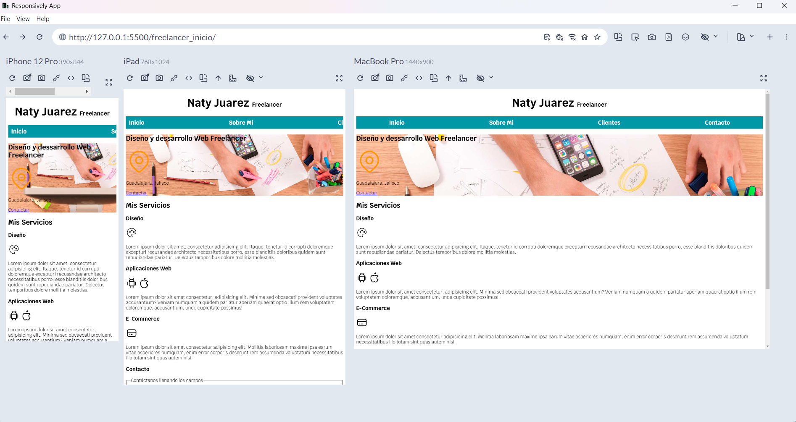
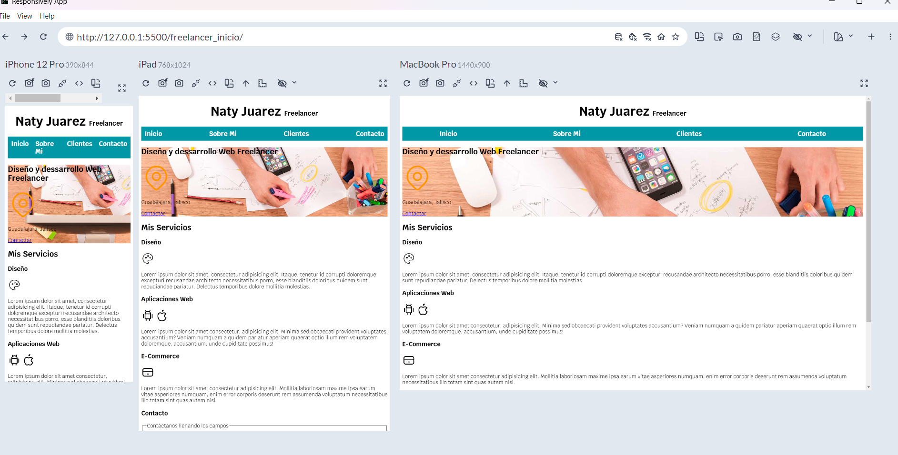
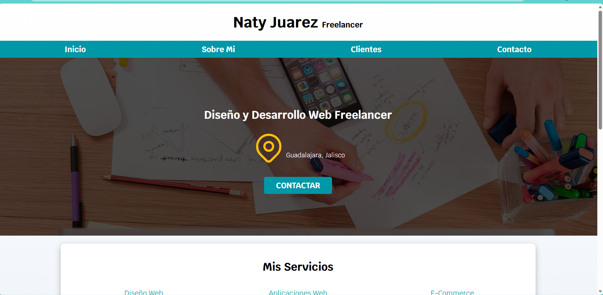

# Construcción del Sitio Web Freelancer

## 1. Introducción a Responsive Web Design
El término "responsive" en diseño web se refiere a la capacidad de un sitio web para adaptarse automáticamente a cualquier tamaño de pantalla y dispositivo (ordenador, tablet, móvil) y ofrecer una experiencia de usuario óptima.
Las media queries son una funcionalidad de CSS que permite aplicar estilos CSS condicionalmente según las características del dispositivo, como el ancho de la pantalla, la resolución o el tipo de medio 

### Paso A. Añadiendo los media Queries
EN EL ARCHIVO CSS escribe:
```css
/*Agregamos el media query Para una tableta*/
@media(min-width:768px){
	.navegacion-principal{
		flex-direction:row;
	}
}
```
Esto permitira adaptar la barra de navegación en dispositivos con un tamaño de 768px.

### Paso B. Modificar la clase contenedor.
Observa que la barra de navegación aun no se adapta a otros dispositivos con pantallas mas pequeñas.


En el archivo CSS..
La clase contenedor debe tener las siguientes propiedades:
```css
	.contenedor{
		max-with:120rem;
		margin:0 auto;
	}
```
Con el cambio anterior puedes notar como la barra de navegación ya se adapta a los distintos tamaño de pantalla.


**Nota:** Para que puedas ver tu sitio web en distintos tipos de dispositivos e ir verificando tu diseño responsivo, puedes utilizar la aplicación **Responsively App**, puedes descargar la aplicación en el siguiente enlace: https://responsively.app/
Una vez decargado, solo escribe la ubicación de tu proyecto en la barra de direccion de la aplicación, y podrás ir visualizando tu proyecto conforme vayas realizando las modificaciones.

### Paso C. Modificar la clase navegacion
EN EL ARCHIVO CSS..
Modificamos la clase .navegacion-principal y agregamos las siguientes 2 lineas:
```css
	.navegacion-principal a {
		display:block;
	    text-align:center;
		display: flex;
    	justify-content:space-between;
	..
	}
```
### Paso D. Mover la propiedad justyfy-content
En el archivo CSS..
Ahora movemos el **justyfy-cotent: space-between** ubicado en **.navegacion-principal** al **@media**, esto es para permitir adaptarse en dispositivos de 768px
```css
	@media(min-width:768px{
	.navegacion-principal{
		Flex-direction:row;
		justity-content:space-between;
		}
	}
```
## 2. Imagenes con CSS
Agregaremos una imagen debajo de la barra de navegación, y la pondremos de fondo, agregandole un estilos

### Paso A: Crear la clase hero
- Crearemos una clase en la etiqueta **`<section>`**, llamada **hero**, para poder darle estilos a esta sección. 
- Tambien crearemos un contenedor con un **`<div>`**, lo cual nos permitirá organizar mejor los elementos que tenemos, admas crearemos una clase para **DIV**, llamada **contenido-hero**
Vaya al codigo HTML, y agregue la clase en la sección, agregue un div creando una clase en el. La seccion debe verse como en el siguiente codigo:
```html
	<section class="hero">
		<div class="contenido-hero">
	        <h2>Diseño y dessarrollo Web Freelancer</h2>
	        <svg
			-----
		</div>
```
### Paso B. Agregar estilos
Ahora agregamos estilos a la clase **hero**, colocaremos de fondo la imagen hero.jpg.
Para esto **primero** eliminamos la imagen que tenemos agregada, para quedarnos solo con la que estará de fondo.
```html
    </div>
  	   <- Elimine esta linea
  	  <!--section-->
	  <section class="hero">
```
Ahora agregue los estilos
```css
.hero{
    background-image: url(../hero.jpg);
    background-repeat: no-repeat;
    background-size: cover;
	height: 450px;
    position: relative;
    margin-bottom: 2rem;
}
```
- Agregamos `background-image: url(../hero.jpg);` para especificar una imagen de fondo para la **sección** de la clase **hero**.
- Debido a que la imagen se repite en pantallas grandes, utilizaremos `background-repeat: no-repeat;`
- Ahora podrás ver que la imagen en algunos dispositivos no abarca toda la pantalla, utilizamos la propiedad: `background-size: cover;` y la imagen tomara todo el ancho disponible

## Diseño de Caja - Box Model
“Una de las cosas que menos me gustan del diseño con CSS es la relación entre el ancho y el relleno. Estás ocupado definiendo anchos para que coincidan con la cuadrícula o las proporciones generales de las columnas, y luego empiezas a añadir texto, lo que requiere definir el relleno para esos recuadros. Y, ¡oh sorpresa!, ahora estás restando píxeles al ancho original para que el recuadro no se expanda.” (**Paul Irlandes**)

Para evitar estar ajustando el tamaño del elemento por los padding y border que le podamos agregar, como solución podemos aplicar el siguiente código css proporcionado por **Paul Irlandes**, desarrollador de Google.

Agrega a la etiqueta html en el archivo css
```css
html{
	Box-sizing:border-box;
}
/*Y agrega el siguiente código después de la etiquema html en el css.*/

*,*:before, *:after{
	Box-sizing:inherit;
	}
```
Este código permitirá seleccionar todos los elementos html, y aplicar el box-sizing, lo que permitirá que se mantenga el tamaño del elemento aunque se agreguen otras propiedades como el padding o border.

## Agregar una sombra a la imagen
Para darle un estilo de sobra a la imagen de fondo que se muestra en nuestro sitio web, tal y como se muestra en la siguiente imagen, debemos realizar lo siguiente:



### Paso A: Agregar estilos a la clase contenido-hero
- Ahora en el css, agregamos los siguientes estilos:
```css
.contenido-hero{
		background-color:rgba(0,0,0,.7)   /*Definimos el color negro con un .7 de trasparencia*/
		width:100%;    /*con un ancho del 100% dentro del contenedor div*/
		height:100%;   /*con un alto del 100%*/
}
```
### Paso B: Modificar LA CLASE .hero{ --}
Agregamos las propiedades:
- `position:relative;` en la clase .hero{ - -} ya que fungirá como el elemento hijo, para que su posición sea en base a la posición que tenga el elemento o clase .hero.
- `position: absolute; ` en la clase .contenido-hero ya que fungirá como el elemento padre, y su posición determinará la del elemento de la clase .hero.
```css
.hero{
	position:relative;
}

.contenido-hero{
	position:absolute;
	background-color:rgba(0,0,0,.7) /*Definimos el color negro con un .7 de trasparencia*/
	width:100%;  /*con un ancho del 100% dentro del contenedor div*/
	height:100% /*con un alto del 100%*/
}
```
## CSS a los heading

### Paso A: Centrar contenido de la clase contenido-hero
La clase **hero** representa el contenedor que contiene un **h2** y el **icono** de ubicaciónmy el párrafo, estos elementos aun se encuentran alineados a la izquierda, nuestro propósito será centrarlo, tanto vertical como horizontalmente. Para esto se hará uso del display flex.
- display: flex es una propiedad CSS que se aplica a un contenedor para organizar sus elementos (ítems) de forma unidimensional, ya sea en fila o columna, permitiendo un control preciso sobre la alineación y distribución del espacio. 

- Cuando aplicamos **display: flex**, y dejamos el valor por default en **flex-direction:row** alineamos horizontalmente con **justify-content** siempre y cuando no tengamos un **flex-direction:column**  y alineamos verticalmente con **align-itens:center;**
- Pero cuando tenemos un **flex-direction:column** alineamos horizontalmente con **align-items:center**, y verticalmente con **justify-content:center**.

En la clase **contenido-hero** agrega los siguientes propiedades:
```css
.contenido-hero{
	----

	display:flex;
	flex-direction:column;
	align-items:center;
	justify-content:center;
}
```
### Paso B: Estilo al párrafo y h2
Colocamos los textos en color blanco, en este caso el h2 y el párrafo. Escribimos:
```css
	.contenido-hero h2,
    .contenido-hero p{
		Color:var(--blanco);
	}
```
Vamos a asignar  a la fuente un tamaño para cada heading de nuestro sitio, para esto lo haremos con las etiquetas h1, h2 y h3.
```css
h1{
	font-size:3.8rem
}
h2{
	font-size:2.8rem;
}
h3{
	font-size: 1.8rem;
}
```
Para todos los heading vamos a darle un ´text-align:center´, lo haremos escribiendo:
```css
h1,h2,h3{
    text-align: center;
}
```
Con esto ya podemos omitir la siguiente clase: Borra ese bloque de css, ya que no sera necesario.
```css
.titulo{
    text-align: center;
    font-size: 3.8rem;
}
```
De esa manera iremos como creando un sistema para organizar nuestros títulos, especificando su formato.

## Centrar el icono de ubicación, y el texto.

### Creación de un `<div>`
Primero crearemos un `<div>` y agregando una clase llamada **ubicación**, esto es para ubicar dentro en él el svg del icono de ubicación y el párrafo `<p>Guadalajara, Jalisco</p>`. Tu código deberá verse de la siguiente manera:
```html
<div class=”ubicacion”>
	 <svg xmlns ---------
    	   -----------
     	   ----------
	</svg>
	<p>Guadalajara, Jalisco</p>
</div>
```
Con esto ya podremos asignarle estilos a la clase, y ubicar el icono y el párrafo de manera centrada.

### Aplicar estilos a la clase .ubicacion
En el archivo css, escribimos:
```css
.ubicación{
	Display: flex; /*Este nos permitirá organizar el contenido de nuestro div, en este caso organizara los elementos como una fila, uno a lado del otro.*/
	justify-content:center; 
	/*Ahora ubicaremos el texto en la parte de abajo, ya que aparece arriba a lado del icono. Para esto escribe:*/
	Align-item: flex-end;  /*esto permitirá alinearlo verticalmente, y colocarlo en la parte de abajo.*/
}
```
## Aplicar estilos al los boton
## Paso A: Crear clase boton
- Primero crearemos una clase llamada **boton** en el enlace que crea al botón Contactar:
```html
    <p>Guadalajara, Jalisco</p>
             </div>
            <a class="boton" href="#">Contactar</a> /*Asegurate que tus lineas de codigo se vean asi*/
        </div>
    </section>
```

### Paso B: Aplicar estilos a la clase boton 
- Nos ubicamos debajo de la clase **.contenedor** y escrimos el css para la clase .boton
```css
.boton{
	background-color: var(--secundario);   /*Para el color de fondo del botón*/
	color: var(--blanco); /*para el color de texto*/
	padding: 1rem 3rem;
	margin-top:1rem;
	font-size:2rem;
	text-decoration:none;
	text-transform: uppercase; /*para transformar el texto a mayúsculas, así si deseamos colocarlo en minúsculas lo hacer en todos los botones con esta propiedad.*/
	font-weight: bold;

	/*Para colocar las esquinas redondeadas, escribimos:*/
	border-radius: .5rem;
	width: 90%;  /*escribimos esta propiedad para que el botón abarque el 90% de la pantalla*/
	text-align: center; /*centramos el texto*/
	 border:none;
}
```
Observa que el botón abarca casi toda la pantalla, y se hace mas notorio el tamaño en pantallas grandes. 

### Paso C: media queries para el boton
Ahora escribimos un media queries para resetear el botón en cuanto a su proporción cuando la pantalla sea de 780px, esto permitirá adaptar el tamaño del boton en otros tamaños de pantallas, escribiendo:

```css
@media (min-width:768px){
	.boton{
    	    Width: auto;
     	}
}
```
NOTA; VISUALIZALO EN LA APLICACION  RESPONSIVE, Y OBSERVA COMO SE ADAPTA A LOS DISTINTOS TAMAÑOS DE PANTALLAS.


