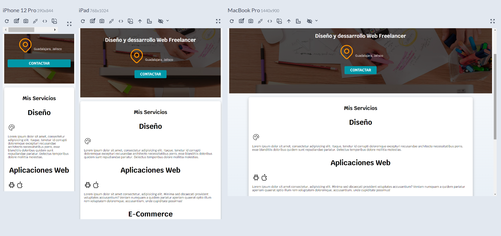
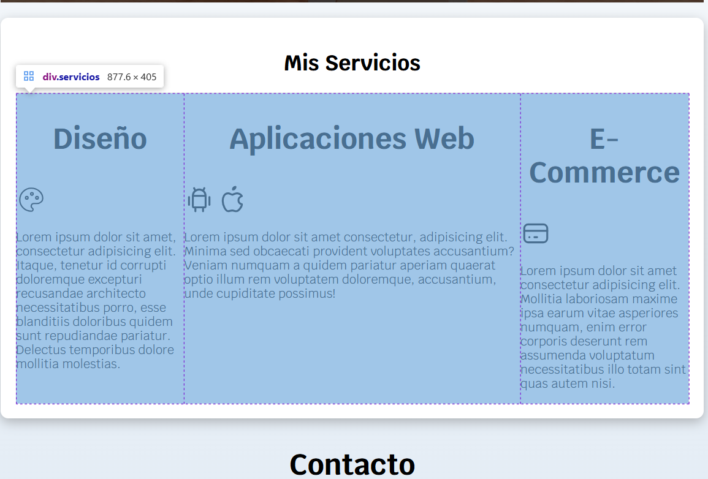
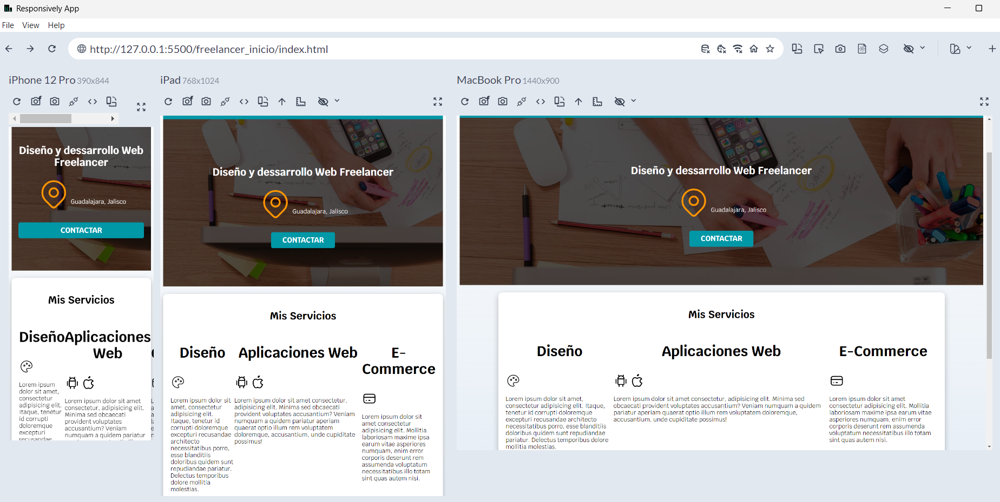
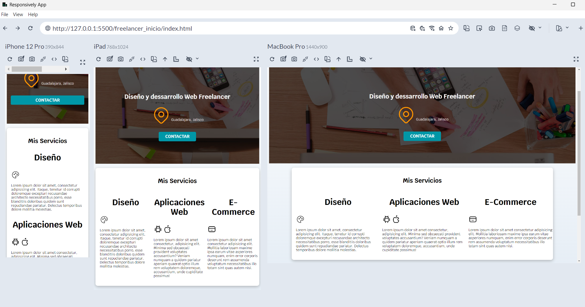
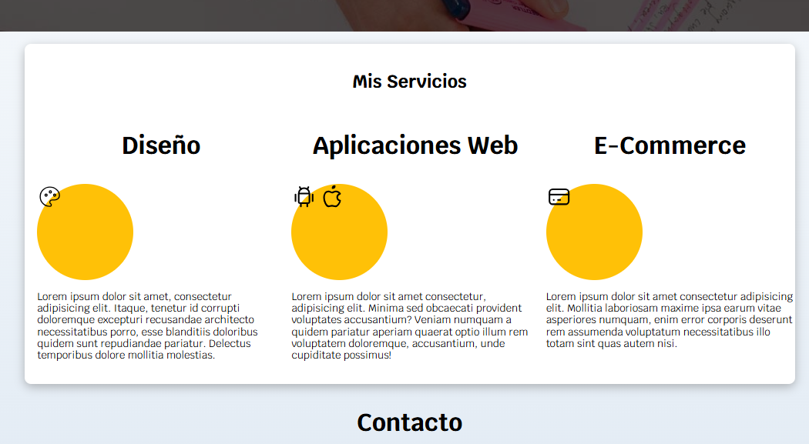
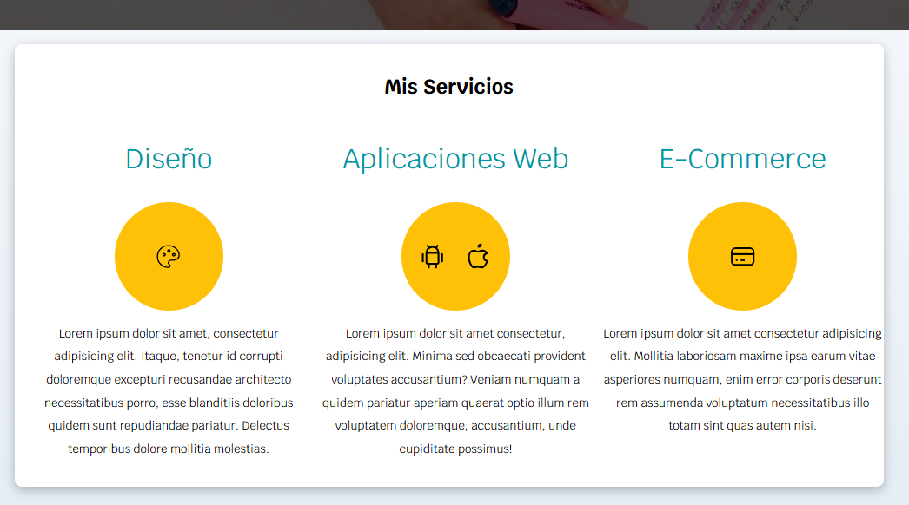
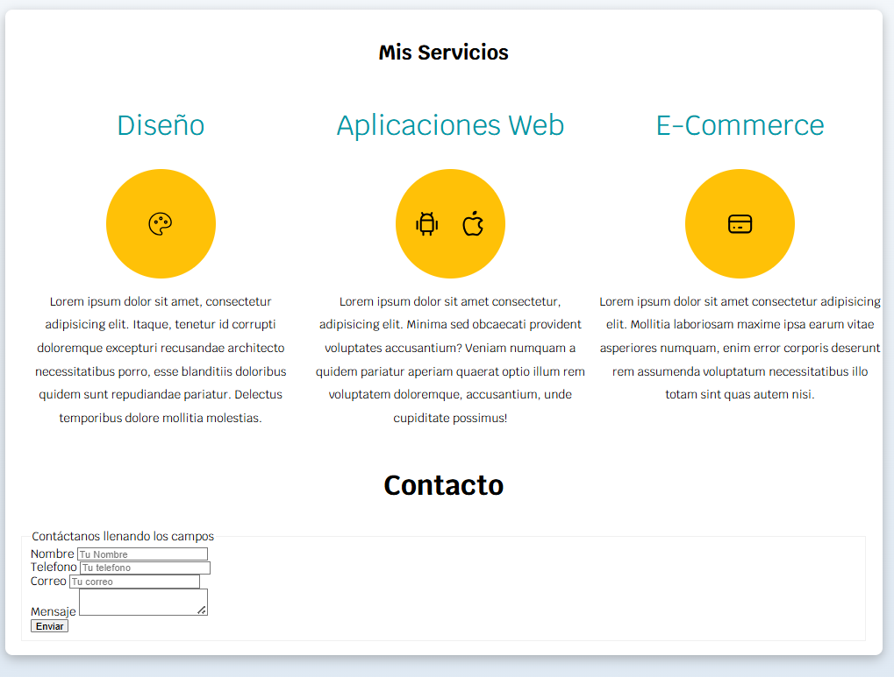
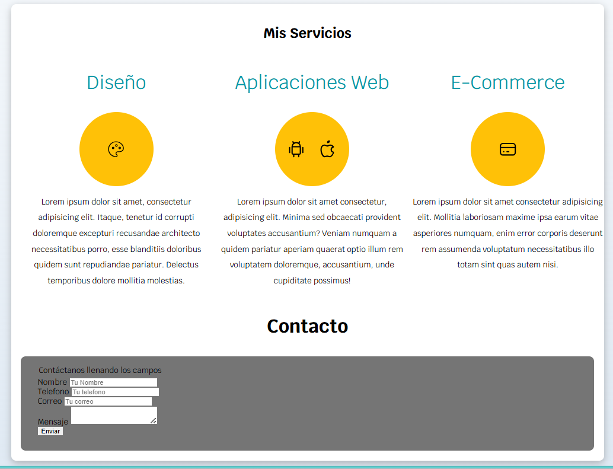
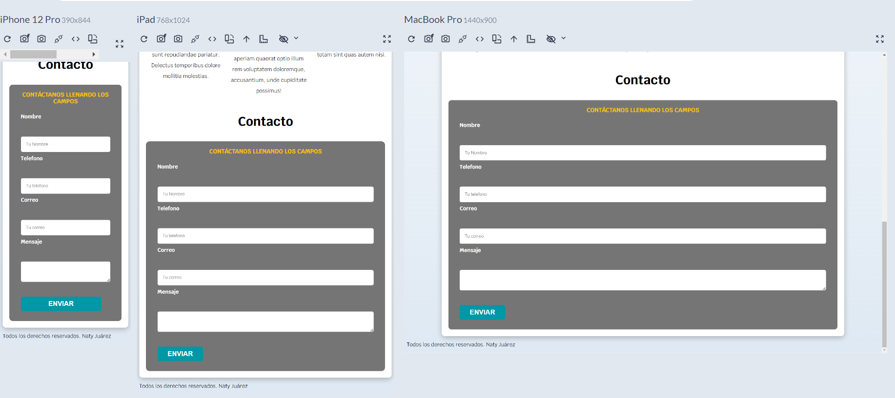
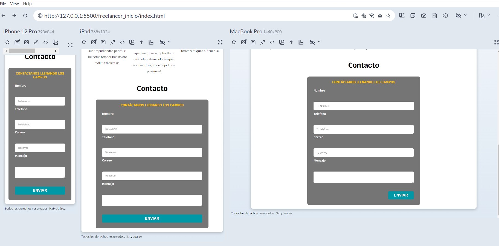

# 3er Avance de construcción del Sitio Web Freelancer

## 1. Degradados con CSS

### A. Agregar un degradado con linear-gradient

Se agregará un color de fondo aplicando degradado para nuestro sitio web. Dado que será para toco el sitio, la propiedad será agregada en la etiqueta **body**.
Para acceder al degradado o gradient en css utilizaremos la propiedad **background-image**, aunque no se trata de una imagen como tal se utiliza esa propiedad. Utilizamos la sintaxis de `linear-gradient (dirección, color1, color2, ...);`

- **dirección:** Especifica la dirección del degradado.
- - **Palabras clave:** Usa palabras como `to top, to bottom, to left, to right,` o combinaciones como `to top right`. Si no se especifica, el valor predeterminado es to bottom.
- **color1, color2, ...:** Al menos dos colores son obligatorios. Puedes usar nombres de color, valores hexadecimales, RGB, etc.
- - **color-stop opcional:** Puedes añadir un porcentaje o longitud (% o px) para indicar dónde debe comenzar un color o dónde debe completarse una transición de color.

En nuestra página el degradado, la dirección va de abajo hacia arriba, entonces se utilizará la palabra clave `to top`. 
Como va de abajo hacia arriba, primero se le pasa con que color iniciará el degradado, y añadimos en que porcentaje o longitud comenzará el color. en segundo lugar, se agregará el color con el que terminará el degradado y el porcentaje en el que terminará.
```css 
body
{
	…….
  background-image: linear-gradient( to top, var(--grisclaro) 0%, var(--blanco) 100%);
}
```
Dado que no tenemos agregado el color gris claro en nuestra paleta de colores agrégalo.
```css 
:root{
  -----
  -----
  --grisclaro:#DFE9F3;
}
```
Observa como se ha agregado el degradado, has tus pruebas con diferentes colores, para que veas el cambio.

### B. Centrar el contenido principal
Aplicaremos estilos al contenido principal (main), para esto reutilizaremos la clase contenedor, cuyo css ya se ha definido, en tu index.html agrégalo a la sección main, como se describe a continuación
```html
<main class=”contenedor”>
	<h2>Mis servicios</h2>
	….
</main>
```

## 2. Sombras con css

Utiliza el siguiente código para agregar una sombra a nuestro contenedor principal. Escribelo arriba del selector h1.

```css

.sombra {
    box-shadow: 0px 5px 15px 0px rgba(112,112,112,0.48);
    background-color: var(--blanco); /*se le agrega un fondo blanco*/
    padding: 2rem; /*agregamos un padding*/
    border-radius: 1rem; /*permitirá darnos un border redondeado*/
}

h1{
    font-size: 3.8rem;
}
```
Ya definidos los estilos para la sombra, ahora agrega esta al contenedor principal (main):
```html
<main class=”contenedor sombra”>
	<h2>Mis servicios</h2>
	….
</main>
```


Vamos a agregar un poco de separación en la imagen de fondo que se encuentra en la clase .hero, entonces escribimos lo siguiente:
```css

.hero{
	--
	margin-bottom:2rem;
}
```
Esto nos permitirá separar el contenido de la clase .hero con el contenido principal.



## 3. Usar CSS grid, para nuestra sección de servicios

Como primer paso vamos a agregar un contenerdor para nuestras 3 secciones creadas para nuestros servicios, escribiendo lo siguiente:
```html
<main class="contenedor sombra">
    <h2>Mis Servicios</h2>	
	<div class=”servicios”>
		<section> ...
		</section>
		<section> ...
		</section>
		<section> ...
		</section>
	</div>
</main>
```
Cerramos el `</div>` después del cierre de la ultima sección, y justo antes del cierre del `</main>`.

### A. Css Grid
- **CSS Grid** es un sistema de maquetación bidimensional para CSS que permite diseñar páginas web dividiéndolas en filas y columnas, facilitando la creación de estructuras complejas de forma más sencilla y coherente.
- Se activa aplicando la propiedad display: grid a un elemento padre, lo que convierte a sus hijos en elementos de la cuadrícula que pueden ser posicionados y organizados de manera precisa.
Ahora vamos a nuestro css, y crearemos un grid para nuestra clase **.servicios**
```css
.servicios{
	display:grid;
	grid-template-columns:33.3% 33.3% 33.3%;
	/*grid-template-columns: repeat(3, 1fr);  realiza lo mismo que la linea anterior*/
}
```


- `grid-template-columns:33.3% 33.3% 33.3%;` esta línea nos permite crear 3 columnas en nuestro grid, cada una con un tamaño del 33.3% del 100% de nuestro contenedor actual. Otra forma más simplificada de crear esas tres columnas es con el código: `grid-template-columns: 1fr 1fr 1fr;` donde fr significa fracción, Lo que quiere decir que cada columna tendrá una fracción del entero que representa al contenedor, y dado que agregamos 1fr 3 veces, son en total 3 fracciones. Asi que `1fr =33.3%`
- `grid-template-columns: repeat(3, 1fr);`  Otra manera de crear 3 columnas con el mismo tamaño es usando `repeat,(3, 1fr)` donde especificamos que se crearan 3 columnas con un tamaño de 1 fracción para cada columna.

Visualiza tu sitio web, y notaras que en dispositivos mas pequeños se mantienen las 3 columnas y se ve amontonado.



Para corregir esto, agregaremos un **@media**, para que las 3 columnas se aplique solo en dispositivos de **768px**. Y edianuestro código quedará así:
```css
@media(min-width: 768px){
	.servicios{
		display:grid;
		grid-template-columns:33.3% 33.3% 33.3%;
}
```

Ahora agregamos una separación entre columnas, para que el contenido no este pegado, esto lo hacemos con la propiedad `column-gap: 1rem;`
```css
@media(min-width: 768px){
	.servicios{
		display:grid;
		grid-template-columns:33.3% 33.3% 33.3%;
		column-gap: 1rem;
}
```


## 4.	Finalizando la sección de servicios.

### Crear clase servicio
Vamos a dar una mejor apariencia a nuestra sección de servicios aplicando css a su contenido. Iniciaremos creando una clase para cada sección de nuestro contenedor servicios. Y crearemos un contenedor para los iconos de cada sección.

La clase para las secciones se llamará **servicio**. Y la clase para cada contenedor de los iconos se llamara **iconos**.
```html
<section class=”servicio”>
	<h3>Diseño Web>/h3>
		<div class=”iconos”>	
			---
		</div>
		<p>Lorem ipsum dolor sit amet, consectetur adipisicing elit. Itaque, tenetur id corrupti doloremque excepturi recusandae architecto necessitatibus porro, esse blanditiis doloribus quidem sunt repudiandae pariatur. Delectus temporibus dolore mollitia molestias.</p>
	</section>

	<section class=”servicio”>
		<h3>Aplicaciones Web>/h3>
		<div class=”iconos”>	
			---
		</div>
		<p>Lorem ipsum dolor sit amet, consectetur adipisicing elit. Itaque, tenetur id corrupti doloremque excepturi recusandae architecto necessitatibus porro, esse blanditiis doloribus quidem sunt repudiandae pariatur. Delectus temporibus dolore mollitia molestias.</p>
	</section>
	<section class=”servicio”>
		<h3>E-commerce>/h3>
		<div class=”iconos”>	
			---
		</div>
		<p>Lorem ipsum dolor sit amet, consectetur adipisicing elit. Itaque, tenetur id corrupti doloremque excepturi recusandae architecto necessitatibus porro, esse blanditiis doloribus quidem sunt repudiandae pariatur. Delectus temporibus dolore mollitia molestias.</p>
	</section>
```
### Css para la clases .servicio y sus elementos.
Escribe los siguientes contenedores en tu archivo css:
```css
	.servicio{
	}
	
	.servicio h3{
	}
	.servicio p{
	}
	
	.servicio .iconos{
	}
```
Iniciaremos escribiendo estilos para los iconos:
```css
.servicio .iconos {
	height:15rem; 				/*altura de 15rem*/
	width:15rem; 				/*ancho de 15rem*/
	background-color: var(--primario);
	boder-radius: 50%; 			 /*permitirá hacer un circulo exacto al colocar el valor en 50% */

	/*centrar los iconos*/
	display: flex;        			/*Habilitamos un display de flex, para accede a las propiedades para centrar */
	justify-content:space-evenly;   /*permitirá centrar los iconos de manera horizontal otorgando un espacio si se muestrab 2 icono en ese espacio*/
	align-items:center;   			 /*centra los icono verticalmente*/
}
```


Podras notar que el contenido de la sección de servicios aun debe alinearse, vamos a la clase .servicio y agregamos lo siguiente:
```css
.servicio{
	display:flex;
	flex-direction:column; /*para que el contenido no lo vaya a colocar uno a lado de otro, ya que el valor por default del display: flex es row*/
	align-items:center;
}
```

Lo siguiente será aplicar un interlineado a los párrafos para que puedan ser mas legibles al leer, y también centraremos el párrafo. Escribimos lo siguiente:
```css
.servicio p{
	line-height:2;
	text-align:center;
}
```
Y finalmente agregaremos estilos a los títulos.
```css
.servicio h3{
	color: var(--secundario);
	font-weight:normal;
}
```
Observa los resultados



## Formulario de la sección contactos

Primero que nada incluiremos el contenido del formulario dentro del main, para esto corta el cierre del main, y colocalo después del cierre del section del formulario.
```html
	</section>
</main>
<footer>
	--
</footer>
```
Notaras que el formulario ya se encuentra dentro de la seccion principal al igual que lose servicios del sitio.



El siguiente paso será agregarle una clase al formulario.
		`<form class=”formulario”>`
Ahora podemos iniciar con la aplicación de estilos al formulario.
```css
/*CONTACTO*/
.formulario{
	
}
.formulario fieldset{
}
```
Podras notar que el formulario tiene un borde, el cual se aplica por default, en este caso para nuestro diseño se lo quitaremos:
```css
	.formulario fieldset{
		border:none;
	
	}
```
Ahora aplicaremos un color de fondo a nuestro formulario
```css
.formulario{
	background-color:var(--gris);
	width: min(60rem 100%); /*Utilizar el valor mas pequeño*/
	margin:0 auto; /*centra el formulario horizontalmente*/
	padding:2rem;  /*agregamos un padding a el contenedor del foulario*/
	border-radius: 1rem; /*colocamos esquinas redondeadas*/
}
```
La función del parámetro `min`, en `Width: min(60rem 100%);` es tomar para el ancho del formulario el valor mas pequeño de entre `60rem` o el `100%` del formulario, comparando si es mas pequeño los `60rem` o el tamaño del formulario tomando el 100% dependiendo del dispositivo en el que se este mostrando.



Vamos a darle formato al `legend` de nuestro formulario
```css 
.formulario legend{
	text-align:center;   	/*centramos el contenido del legend*/
	font-size:1.8rem; 		/*aplicamos tamaño*/
	text-transform:uppercase; /*Lo convertimos en mayusculas*/
	font-weight: 700; 		/*lo colocamos en negrita*/
	margin-bottom:2rem; 	/*le colocamos un margin hacia abajo*/
	color: var(--primario); /*aplicamos color*/
}
```

## 6.	CSS a los inputs.

### Crear contenedor para los campos
Primero agregaremos un contenedor con un `<div>` creando la clase **contenedor-campo**, para colorcarl todos los campos del formulario.
```html
<div class:”contenedor-campos”>
	<div>
		<label>Nombre</>
		<input type=”text” placeholder=”Tu nombre”>
	</div>
	---
	---
</div> <!-- .contenedor-campos-->
```

Cierre el contenedor div, antes del div del botón enviar.
### Crear clase campo
Ahora a cada div para cada campo, agrega la clase campo.
```html
<div class:”contenedor-campos”>
	<div class=”campo”>
		<label>Nombre</>
		<input type=”text” placeholder=”Tu nombre”>
	</div>
	---
	---
</div> <!-- .contenedor-campos-->
```

### Especificar selectores
 Creamos nuestros selectores, para posteriormente aplicarle estilos.
```css
.contenedor-campos{
}
.campo{
}

.campo label{
}
```
### Aplicar estilos a campo
Aplicamos los siguientes etilos:

```css
.campo{
	margin-bottom:1rem;
}

.campo label{
	color: var(--blanco);
	font-weight: bold;
	margin-bottom: .5rem;
	display: block;
}

.campo textarea {
    height: 20rem;
}
```

### Agregar estilos a los `<input>`
Ahora agregaremos estilos a los **inputs** del formulario, para esto primero crearemos una clase para todos los inputs, escribiendo lo siguiente:
En html
```html
<div class:”contenedor-campos”>
		<div class=”campo”>
                   <label>Nombre</label>
                    <input class=”input-text” type="text" placeholder="Tu Nombre">
   		</div>
                
		<div class=”campo”>
                    <label>Telefono</label>
                    <input class=”input-text” type="tel" placeholder="Tu telefono">
 		</div>
                
		<div class=”campo”>
                    <label>Correo</label>
                    <input class=”input-text” type="email" placeholder="Tu correo">
  		</div>
		<div class=”campo”>
                    <label>Mensaje</label>
                    <textarea class=”input-text”></textarea>
		</div>
                
		<div class=”campo”>
                    <input type="submit" value="Enviar">
		</div>
</div> <!—contenedor-campos--->
```

### Aplicar css a la clase input-text
	
LO SIGUIENTE es aplicar css a la clase input-text
```css
.input-text{
	width:100%
	border: none;
	padding: 1.5rem;
	border-radius: .5rem;
}
```

### Agregar estilos al botón Enviar

Ahora agregamos estilos al botón enviar,  para esto reutilizaremos la clase botón, añadiendo esa clase al input con el que se creo el botón enviar.
```html
		<div>
                    <input class=”boton” type="submit" value="Enviar">
    	</div>
```
Ahora es importante que verifique que el selector .boton se encuentre debajo del selector .contenedor, como se muestra a continuación:
```css
.contenedor {
    max-width:120rem;
    margin: 0 auto;
}

.boton{
    background-color: var(--secundario);   /*Para el color de fondo del botón*/
	color: var(--blanco); /*para el color de texto*/
	padding: 1rem 3rem;
	margin-top:3rem;
	font-size:2rem;
	text-decoration:none;
	text-transform: uppercase; /*para transformar el texto a mayúsculas, así si deseamos colocarlo en minúsculas lo hacer en todos los botones con esta propiedad.*/
	font-weight: bold;

	border-radius: .5rem; /*Para colocar las esquinas redondeadas, escribimos:border-radius*/
	width: 90%;  /*escribimos esta propiedad para que el botón abarque el 90% de la pantalla*/
	text-align: center; /*centramos el texto*/
    border:none;
     
}
```
Si observas el puntero de la mano no aparece cuando lo pasas sobre el botón enviar, eso es por que los inputs lo eliminan cuando se aplican estilos, entonces agregaremos lo siguiente:
```css
.boton:hover{
	cursor:pointer;
}
```
Observa como va quedando tu sitio, y podrás notar que el botón no toma todo el espacio disponible.




###Crear Utilidades para el Sitio
Ahora en css, crearemos unas clases que nos servirán de utilidades, ya que podrán aplicarse a distintos elementos.
Nos ubicamos después del contenedor `.titulo span`, y agregamos lo siguiente:

```css
/**UTILIDADES**/
.w-sm-100{
	width:100%;
}
.flex{
	display:flex;
}
.alinear-derecha{
	justify-content:flex-end;
}
```
Con esto cada utilidad nos permitirá hacer lo siguiente:
- `w-sm-100`: aplicar un ancho del 100% al elemento
- `.flex `: aplicar un display flex
- `.alinear-derecha`: como su nombre lo indica alinear el elemento a la derecha

Ahora aplica las utilidades creadas:
```html
<div class=”alinear-derecha flex”>
          <input class=”botón w-sm-100”  type="submit" value="Enviar">
</div>
```


Dado que el botón abarca todo el ancho del contenedor del formulario cuando la pantalla es grande, vamos a aplicar un `@media queries`, para que se el ancho al 100% se ajuste cuando las pantallas tengan 768px.

IMAGEN

Debajo de la utilidad `w-100`, escriba:
```css
@media (min-width:780px){
	.w-sm-100{
		Width:auto;
}
```

Visualice nuevamente el sitio en los distintos dispositivos, y note como el botón ya se ajusta de manera distinta en cada dispositivo.





## 7. Posicionamiento de los inputs

Observa que el diseño que aplicaremos tendrá 2 campos en la primera línea, y en el resto hay un campo por línea. Esto lo lograremos aplicando grid.
Recordemos que tenemos un contenedor llamado `contenedor-campos`, este lo utilizaremos para la distribución de nuestros campos.


Vamos a nuestro ccss y arriba de nuestro selecctor llamado **.campo**, agregamos lo siguiente:
```css
@media(min-width:768px)
{
.contenedor-campos{
		display: grid;
		grid-template-columns: 50% 50%;
		column-gap: 1rem;
		grid-template-rows: auto auto 20rem;  }
```

- @media(min-width:768px) : Agregamos un media query para que el diseño se aplique para dispositivos que tengan una pantalla de 768px.
- display: grid:  dado que organizaremos nuestros campos utilizando un grid, escribimos esta línea para definir que lo utilizaremos.
- grid-template-columns: 50% 50%; nos permitirá crear 2 columnas iguales en mi grd.
- column-gap: 1re:  nos permitirá agregar una separación entre columnas.
- grid-template-rows: auto auto 20rem;  permitirá definir un tamaño para cada fila.

Ahora nos daremos a la tarea de colocar los campos correo y mensaje uno en cada fila. Utilizaremos  un **pseudo-clase** llamada `:nth-child() `

`nth-child()` es una pseudo-clase de CSS que permite seleccionar elementos hijos basándose en su posición entre sus hermanos.

- Recordemos que tenemos los campos nombre, teléfono, correo y mensaje, todos estos tienen asignada una clase llamada campo, con esto podremos utilizar la pseudo-clase `nth-child`, para referirnos a un campo en específico.

Por ejemplo, si tenemos:
- `.campo: nth-child(1 );` nos permitirá seleccionar el primer campo es decir el campo nombre;
- `nth-child(2)`, selecciona el segundo campo, es decir el campo teléfono, y así sucesivamente.
- 
 Accedemos a la clase **campo** utilizando la pseudoclase `nth-child` y escribimos dentro de nuestro media query después de `contenedor-campo` :
```css
.campo: nth-child(3),
.campo: nth-child(4) { 
		grid-column: 1/3;
}
```
Y todo nuestro código para organizar nuestros campos finalmente quedo así;
```css
@media(min-width:768px)
{
	.contenedor-campos{
		display: grid;
		grid-template-columns: 50% 50%;
		column-gap: 1rem;
		grid-template-rows: auto auto 20rem;  
	}
	.campo: nth-child(3),
	.campo: nth-child(4) { 
		grid-column: 1/3;
	}
}
```
- grid-column: 1/3: esta línea permitirá que los campos que haya especificado en este caso el 3er campo y el 4to, puedan abarcar de la columna 1 a la 3.


## Aplicar css al Footer.
Nuestro siguiente paso será agregar css al footer de nuestro sitio web, para esto primero le agregamos una clase llama footer al elemento html que tiene el mismo nombre.
```html
<footer class=”footer”>
	<p> Todos los derechos reservados. Naty J </p>
</footer>
```

En nuestro css, escribimos los siguiente para darle estilo a esta sección.
```css
/*Footer*/
`.footer{
	text-align: center;
}
```
Ahora verifica en la aplicación responsively que nuestro diseño ya se ve mucho mejor.

