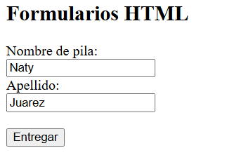
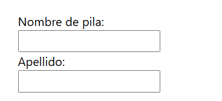

# Formularios HTML
Se utiliza un formulario HTML para recopilar la información del usuario. Esta información suele enviarse a un servidor para su procesamiento. Son fundamentales en el desarrollo de aplicaciones web, ya que permiten la interacción entre el usuario y la aplicación (por ejemplo: registrarse, iniciar sesión, enviar comentarios o subir archivos).

## El elemento `<form>`
El `<form>` elemento HTML se utiliza para crear un formulario HTML para la entrada del usuario:

```html
<form>
.
form elements
.
</form>
```


El elemento `<form>` es un contenedor para diferentes tipos de elementos de entrada, como: campos de texto, casillas de verificación, botones de opción, botones de envío, etc.

### El elemento `<input>`

El elemento HTML `<input>` es el elemento de formulario más utilizado.

Un elemento `<input>` se puede mostrar de muchas maneras, dependiendo del type atributo.

A continuación se muestran algunos ejemplos:
|                  Tipo                     |                                      Descripción                                      |
| ----------------------------------------- | ------------------------------------------------------------------------------------- |
| `<tipo de entrada="texto">`               | Muestra un campo de entrada de texto de una sola línea                                |
| `<tipo de entrada="radio">`               | Muestra un botón de opción (para seleccionar una de muchas opciones)                  |
| `<input type="casilla de verificación">`  | Muestra una casilla de verificación (para seleccionar cero o más de muchas opciones)  |
| `<input type="enviar">`                   | Muestra un botón de envío (para enviar el formulario)                                 |
| `<tipo de entrada="botón">`               | Muestra un botón en el que se puede hacer clic                                        |

### Campos de texto
Define `<input type="text">` un campo de entrada de una sola línea para la entrada de texto.

Ejemplo
Un formulario con campos de entrada para texto:

```HTML
<form>
  <label for="fname">First name:</label><br>
  <input type="text" id="fname" name="fname"><br>
  <label for="lname">Last name:</label><br>
  <input type="text" id="lname" name="lname">
</form>
````
Así es como se mostrará el código HTML anterior en un navegador:



### El elemento `<label>`
Observe el uso del <label>elemento en el ejemplo anterior.

La etiqueta `<label>`  define una etiqueta para muchos elementos de formulario.

El elemento `<label>`  es útil para los usuarios de lectores de pantalla, porque el lector de pantalla leerá en voz alta la etiqueta cuando el usuario se centre en el elemento de entrada.

El elemento `<label>` también ayuda a los usuarios que tienen dificultades para hacer clic en regiones muy pequeñas (como botones de opción o casillas de verificación), porque cuando el usuario hace clic en el texto dentro del `<label>` elemento, alterna el botón de opción o la casilla de verificación.

El atributo for de la etiqueta `<label>` debe ser igual al idatributo del `<input>` elemento para unirlos.

### Botones de radio
El `<input type="radio">` define un botón de opción.

Los botones de opción permiten al usuario seleccionar UNA de un número limitado de opciones.

**Ejemplo**
Un formulario con botones de opción:
```HTML
<p>Choose your favorite Web language:</p>

<form>
  <input type="radio" id="html" name="fav_language" value="HTML">
  <label for="html">HTML</label><br>
  <input type="radio" id="css" name="fav_language" value="CSS">
  <label for="css">CSS</label><br>
  <input type="radio" id="javascript" name="fav_language" value="JavaScript">
  <label for="javascript">JavaScript</label>
</form>
```

Así es como se mostrará el código HTML anterior en un navegador:
