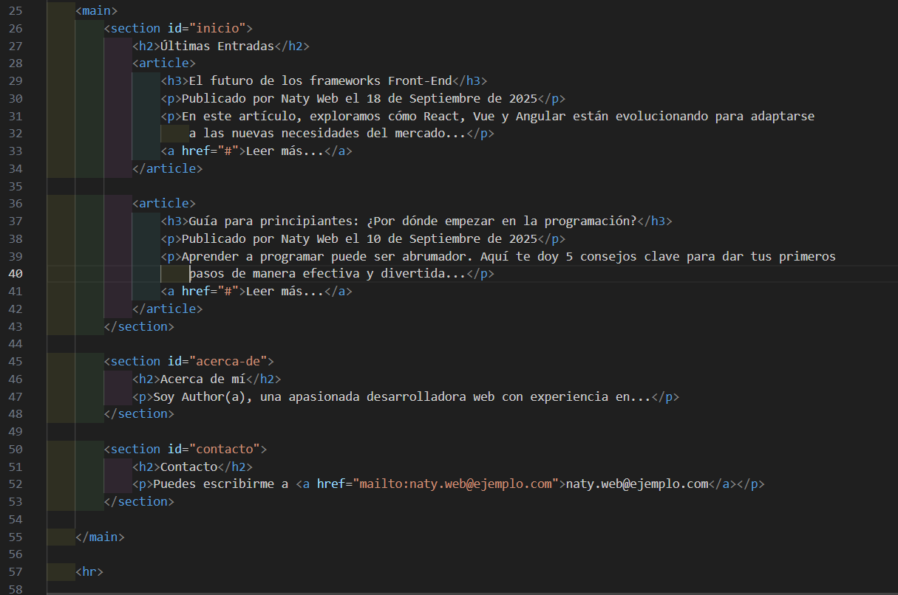

# Formularios HTML
Se utiliza un formulario HTML para recopilar la información del usuario. Esta información suele enviarse a un servidor para su procesamiento. Son fundamentales en el desarrollo de aplicaciones web, ya que permiten la interacción entre el usuario y la aplicación (por ejemplo: registrarse, iniciar sesión, enviar comentarios o subir archivos).

## El elemento `<form>`
El `<form>` elemento HTML se utiliza para crear un formulario HTML para la entrada del usuario:

```html
<form>
.
form elements
.
</form>
```
El elemento `<form>` es un contenedor para diferentes tipos de elementos de entrada, como: campos de texto, casillas de verificación, botones de opción, botones de envío, etc.

### El elemento `<input>`

El elemento HTML `<input>` es el elemento de formulario más utilizado.

Un elemento `<input>` se puede mostrar de muchas maneras, dependiendo del type atributo.

A continuación se muestran algunos ejemplos:
|                  Tipo                     |                                      Descripción                                      |
| ----------------------------------------- | ------------------------------------------------------------------------------------- |
| `<tipo de entrada="texto">`               | Muestra un campo de entrada de texto de una sola línea                                |
| `<tipo de entrada="radio">`               | Muestra un botón de opción (para seleccionar una de muchas opciones)                  |
| `<input type="casilla de verificación">`  | Muestra una casilla de verificación (para seleccionar cero o más de muchas opciones)  |
| `<input type="enviar">`                   | Muestra un botón de envío (para enviar el formulario)                                 |
| `<tipo de entrada="botón">`               | Muestra un botón en el que se puede hacer clic                                        |

### Campos de texto
Define `<input type="text">` un campo de entrada de una sola línea para la entrada de texto.

Ejemplo
Un formulario con campos de entrada para texto:

```HTML
<form>
  <label for="fname">First name:</label><br>
  <input type="text" id="fname" name="fname"><br>
  <label for="lname">Last name:</label><br>
  <input type="text" id="lname" name="lname">
</form>
````
Así es como se mostrará el código HTML anterior en un navegador:



